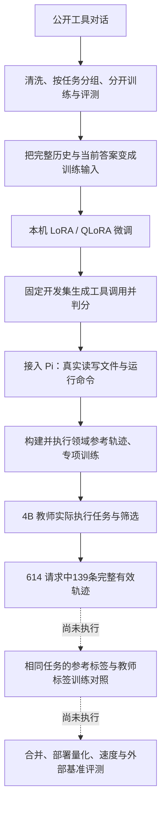
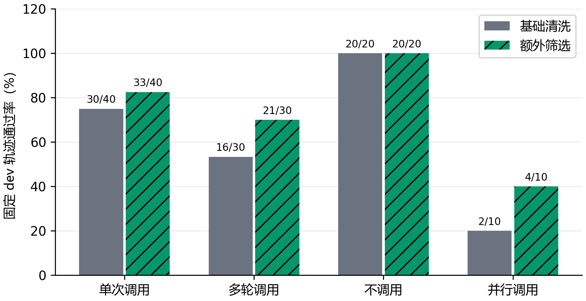

# MiniLLM：实验学习、评测复盘与简历指南

这份文档回答三个问题：这个项目到底做了什么，结果说明了什么，以及怎样把项目经历变成自己能够解释的大模型知识。事实截至 **2026 年 10 月 3 日**，依据已经落盘的配置、逐条结果、训练记录和参数检查整理。

最明确的成果是：在本机完成 Qwen3-1.7B 的工具调用微调，固定 500 条公开工具开发集上，原模型加固定提示示例通过 355 条；使用1万条训练数据，三个训练随机种子（seed）分别通过 409、410、411 条，平均从 **71.0% 提高到 82.0%，增加 11.0 个百分点**。同时，真实文件任务评测暴露了迁移困难：领域微调模型在固定 Pi test 上通过 **4/40**，专项训练没有改善同提示 dev 成绩。教师轨迹生成完成 614 条请求，139 条通过执行与完整编码，但蒸馏训练尚未完成。

这里的价值既包括模型表现的改善，也包括把数据、训练、评测和排错连成了可以追溯的过程。阅读时要把“已经做过”与“自己已经理解”分开；后者需要能够讲清选择的理由、评分规则和失败原因。

## 怎么使用这份文档

建议先读第 1、7、8、12 节，建立整体认识，再从数据、训练机制和评测细节向下追。文末有 **36 个编号问题**，可以直接这样继续学习：

> 请讲 Q11，先用普通话解释，再带我看项目中的真实代码，最后给我一道检查理解的小题。

> 请讲 Q23，用一个真实失败任务串起模型输入、工具调用、工具返回和最终判分。

正文中的代码块只摘出核心意思；带编号的实验和代码链接用于继续查实现。所有曲线都是已有真实记录生成的图，不用示意曲线代替测量结果。

阅读顺序：

1. [项目目标与完整路线](#1-项目在解决什么问题)
2. [数据与训练输入](#3-训练集到底是用来教什么的)
3. [微调的工作方式](#4-模型是怎样被微调的)
4. [训练链路核验](#5-怎样证明训练真的发生了)
5. [实际效果与对照实验](#7-微调效果到底提高了多少)
6. [评测的详细规则](#8-评测到底怎么做为什么分数不能混在一起)
7. [Agent 失败与蒸馏进度](#9-为什么公开工具成绩不错真实任务仍然困难)
8. [简历与追问目录](#12-简历现在可以怎样写)

## 1. 项目在解决什么问题

普通聊天模型可以解释“怎样修改配置”，但让它实际做事还要多几步：读文件、选择工具、填写参数、处理工具返回、执行修改，再确认最终结果。项目想验证的是：**在一张消费级显卡上，能否用公开工具数据和本机任务轨迹，让一个小模型更可靠地选择和使用工具。**

学生模型是官方 Qwen3-1.7B，教师模型是官方 Qwen3-4B。这两个模型在下载时已经具备语言能力。本项目是在已有模型上继续训练任务行为，没有从零预训练语言模型，也没有把 4B 的结构直接裁成 1.7B。

整个过程可以沿着这条路线理解：



这里有两个不同的学习目标。第一个是把微调做对：数据表示正确、训练参数确实更新、结果可重现。第二个是把任务做好：在新的场景中生成正确动作，并能根据真实错误调整下一步。项目在第一个目标上形成了较完整的证据，在第二个目标上同时得到改善和明确的负结果。

## 2. 用了哪些技术，它们各自做什么

技术名可以先当作工具的名字，不必一开始记缩写。先理解它负责哪一段工作。

| 技术或组件 | 用普通话解释 | 本项目实际用途 |
| --- | --- | --- |
| PyTorch 与 CUDA | 让模型在显卡上计算，并根据错误更新参数 | 前向、求梯度、优化器更新、显存测量 |
| Transformers | 加载模型与把对话变成模型能读的数字 | 加载 Qwen3、使用官方对话模板、生成回复 |
| TRL 的 SFTTrainer | 把“看题目、学参考回答”的训练过程组织起来 | 正式监督微调、验证、保存训练状态 |
| PEFT / LoRA | 在基础模型旁添加一小部分可训练参数 | 只更新适配器，保留基础模型权重 |
| bitsandbytes / NF4 | 压缩基础权重的存储 | 用四位量化加载基础模型，再训练 LoRA |
| BF16 | 计算时使用的一种数值表示 | 降低计算存储负担，支持混合精度计算 |
| JSON Schema | 对工具的名字、必填项和参数类型定规则 | 检查调用结构是否合法 |
| Pi 0.99.1 | 组织模型与工具之间的多轮会话 | 把本机模型接入 read、edit、write、bash |
| Docker | 给每道文件任务建立独立的小工作环境 | 初始化文件、执行动作、判分、回收环境 |
| Python / Node.js 脚本 | 把各段工作串起来 | 数据处理、训练、模型接口、任务运行器与记录 |
| Git、SHA-256、归档清单 | 保存版本，并确认文件内容是否相同 | 对齐配置、代码、结果、checkpoint 与图表 |

本机为 Windows，显卡是 **RTX 4070 SUPER，12GB 显存**。训练环境单独锁定，包含 PyTorch 2.8.0+cu128、Transformers 4.56.2、TRL 0.22.2、PEFT 0.17.1、bitsandbytes 0.47.0 等。记录版本的作用是帮助解释和复现行为，尤其是不同库如何准备量化模型、何时冻结参数。

项目的训练、教师生成、推理和模型评测均在本机运行。公开工具数据中的外部服务返回是来源标注；真正的本机执行发生在 Pi 文件任务和规则参考核验中。

## 3. 训练集到底是用来教什么的

### 3.1 一条样本教的是一个决策过程

公开数据主要来自 Hermes 工具调用数据和 Glaive v2。它们包含用户请求、可用工具说明、助手调用、工具返回以及后续回复。训练目标不是让模型记住一张工具名单，而是让它学会：

- 什么时候调用工具，什么时候直接回答，什么时候先问缺失信息；
- 在当前提供的工具中选择合适的函数；
- 从用户信息或前面的工具返回里填参数；
- 在多轮对话中利用历史信息，处理多个调用和最后的回复。

下面是一条真实错误回复的调用摘录。用户只说想听音乐，没有给出类型，1k 微调模型却自行补了 `pop`：

```json
{"name": "play_music", "arguments": {"genre": "pop"}}
```

它格式正确，也可能通过参数类型检查，但这个值没有足够依据。合适的训练数据应让模型先询问音乐类型。这个例子说明：**能写出 JSON，与正确理解该不该调用，是两种能力。**

### 3.2 原始数据到冻结训练集经历了什么

| 环节 | 实际数量 | 这个数量代表什么 |
| --- | ---: | --- |
| 读取原始来源记录 | 121,955 | 包含重复、缺工具定义和其他不适用记录 |
| 结构检查并去除完全重复后 | 62,386 | 能按项目规定表示的轨迹，不等于语义全正确 |
| 按任务特征归组后 | 23,801 组 | 防止同一任务的部分变体随意跨集合 |
| 正式规模训练集 | 1,000 / 5,000 / 10,000 | 三个集合嵌套，每组选择代表记录 |
| 公开工具原始 dev / test | 各 500 | dev 用于选择与比较；test 保留独立用途 |

清洗检查工具名是否存在、必需参数是否齐全、参数类型是否合法、调用与返回是否完整。对于某些混用引号的历史数据，只做安全解析；不能解析就拒绝，不靠猜答案修复。

去重不只看 id。相同问题可能换了数字或引号内容，仍然很接近。项目按工具名、参数签名和规范化首问归组，再划分 train、dev、test。实际任务组交集为零，但这种规则不能保证发现所有同义改写，更不能证明模型预训练时没有见过类似内容。

训练区只选择能在 2048 token 内完整表示的记录，不把工具调用截到一半。dev 和 test 的表示可以保留到 8192 token。token 是模型读取的数字片段，不等同于一个汉字或一个英文词。

### 3.3 为什么需要人工读样本

基础清洗后的 50 条抽查中，44 条未见明显错配，2 条有参数来源问题，4 条有占位、时间或实体方面的疑点。后续质量筛选又发现：规则会误删合理转换，例如 `Apple` 对应股票代码 `AAPL`，也会漏掉“工具未执行邮件发送，最终回答却声称已发邮件”这样的语义问题。

因此，抽查的作用是发现规则盲区，不能把抽查结果叫作整批数据的准确率。清洗规则通过只能说明符合规则；要保证动作真的有效，还需要实际执行或更强的语义核验。

### 3.4 一条对话为什么会变成多条训练输入

模型每次只生成当前这一步回答。一个包含多次工具动作的完整对话，会展开成多个训练单元，每个单元都保留此前的完整历史，只把当前助手回复作为要学习的目标。

例如，一条参考过程是“运行检查失败 → 读函数 → 修改函数 → 再运行检查 → 回答结果”。模型不是一次背下整段过程，而是在每个位置学习此时该采取的动作。错误返回留在历史里，使下一步有依据恢复。

10k 正式数据实际展开为 **29,073 个回复单元、1,282,656 个监督 token**。所以“训练 10k 条数据”不等于“更新了 10k 步”，也不等于只训练了 10k 个短答案。

## 4. 模型是怎样被微调的

### 4.1 先把对话变成正确的输入

模型不能直接阅读 Python 字典。工具定义、system、user、assistant、tool 各种消息，需要按模型的官方格式排成文本，再转为数字 token。这个排版规则就是对话模板。

这些角色表示消息来自谁：system给任务规则，user提出要求，assistant是模型回答或动作，tool是程序执行后的返回。保留角色可以让模型区分“用户要求做什么”与“工具实际上发生了什么”。

如果训练时“当前助手开始的位置”与推理时不一致，模型可能在错误的上下文里学会答案。本项目曾出现这种问题：完整多轮训练的助手前缀，与关闭 thinking 后当前轮生成前缀不一致。训练 loss 已很低，工具调用仍没有完全学对。随后改为每个当前回复单独展开，逐条核对真实生成前缀。

为了找到助手部分，项目使用带监督标记的模板，但要求它渲染出的文本和 token 与官方模板一致。标记帮助定位，不允许改变模型实际看到的对话。

### 4.2 输入保留全部历史，评分只看当前回复

可以把训练理解为给模型一道带背景材料的题。背景材料必须读，但老师评分的是它写出的当前答案，不是要求它背出用户的问题或工具已经返回的内容。

```python
# 历史仍在 input_ids 中；这些位置不直接参与当前回复评分
labels[:target_start] = -100
```

`-100` 是框架约定的“这一位置不计算损失”。system、user、工具返回、此前助手消息以及补齐长度的 padding，都不是当前单元要预测的目标。把标签遮住不会把这些内容从输入中删除。


这张图来自一个真的经历过命令失败的训练单元。灰色位置只提供上下文，末尾的监督位置用于学习下一次 `read` 调用。它验证的是数据表示正确，还不能证明模型已经学会错误恢复。

### 4.3 loss 是什么，为什么越低还不一定越会做事

loss 可以理解为模型对参考答案的预测误差。模型逐个位置预测下一个 token；参考答案越容易被它预测，交叉熵 loss 通常越低。

“已经正确”与“更加确信”都会影响 loss，但工具评测常常只问最终调用是否全部符合要求。例如答案中只错一个参数，其他几十个 token 都预测得很好，loss 可以很低，任务仍然失败。

项目用同一批输入、同一份模型输出，手工算了这项误差：助手监督部分有 139 个目标 token，手算与框架均为 **1.762018**。全文监督时目标变为 980 个，两边均为 **2.762061**。两个结果分别对齐，说明标签和计算没有错位；不能用它们的大小判断哪种训练效果更好，因为参与计算的内容不同。

```python
import torch.nn.functional as F

# 第 t 个位置的预测，对应第 t+1 个位置的标签
logits = output.logits[:, :-1].float()
labels = inputs["labels"][:, 1:]
manual = F.cross_entropy(
    logits.reshape(-1, logits.shape[-1]),
    labels.reshape(-1), ignore_index=-100,
)
```

### 4.4 LoRA 为什么能少训练一些参数

基础模型有大量权重。LoRA 不把它们全部改一遍，而是在选定的层旁增加两块较小的矩阵，学习一个修正量：

```text
本次使用的权重 = 固定的基础权重 + B × A × alpha / rank
```

rank 决定修正矩阵的宽度；alpha 决定修正量的缩放；dropout 在训练时随机屏蔽一部分适配器输入，用来约束拟合。它们不是“知识容量”“聪明程度”的直接刻度。

rank 16 在本项目实际开放 **17,432,576 个可训练参数**，基础权重冻结。保存适配器可以保留这次任务行为的修正，再与相同基础模型一起加载。

### 4.5 QLoRA 的四位和 BF16 各指什么

QLoRA 在这里是“量化保存基础权重，再训练 LoRA”。NF4 是四位量化的存储表示；BF16 是计算时使用的表示。适配器及其他部分仍可能以更高精度保存和计算，所以不能说所有训练计算都变成了四位。

好处是减少基础权重的存储负担。代价可能包括量化相关的额外操作，速度需要实际测量。第 7 节的对照显示，这台机器上 QLoRA 节省了张量显存，却没有更快训练。

### 4.6 一次正式训练具体怎样推进

主要正式条件是 rank 16、alpha 32、dropout 0.05、学习率 1e-4、一个 epoch。显卡一次处理一个回复单元，积累 8 次梯度后做一次参数更新。这样降低单次计算的内存需求，同时让更新综合多条输入。

一次训练可以拆成四个动作：前向是让模型对输入预测答案；计算loss是比较预测与参考；反向是计算哪些可训练参数、朝什么方向改变会影响这项误差，这些变化信号叫梯度；优化器再根据梯度和学习率小幅调整参数。推理只需要生成回复，通常不做后面的求梯度和参数更新。

一个 epoch 表示展开后的训练单元各参与一遍。学习率先在最初 3% 的更新中逐渐上升，再线性下降；AdamW 根据梯度更新适配器，梯度裁剪上限为 1.0。关闭 packing，即不把不同任务拼接成一条更长输入。

```python
training_args = SFTConfig(
    num_train_epochs=1,
    per_device_train_batch_size=1,
    gradient_accumulation_steps=8,
    learning_rate=1e-4, warmup_ratio=0.03,
    assistant_only_loss=True, packing=False, bf16=True,
)
```

这段是关键参数摘录。正式入口还包含已经准备好的输入和 labels、验证、保存、优化器等设置；不能只复制这几行就认为完成了项目的训练实现。

## 5. 怎样证明训练真的发生了

### 5.1 先检查显卡计算，再检查参数变化

第一层是环境检查：系统能看见 NVIDIA 显卡，还不代表 Python 中的 PyTorch 能用 CUDA。项目最初的解释器装的是 CPU 版 PyTorch，后来在隔离环境中验证了真实 GPU 前向、反向和 NF4 加载。

第二层是训练检查：`requires_grad=True` 只说明允许求梯度，不代表梯度存在或优化器改了参数。因此实际检查了梯度数值、更新前后的参数哈希，并确认冻结权重未变、适配器已变。

LoRA 默认初始化里 B 是零，所以第一步 A 梯度为零是正常现象。实际第一步是 A 0/196、B 196/196 个张量有非零梯度；B 更新后，第二步 A 和 B 都是 196/196。理解初始化比看到一个零就改训练更有用。

### 5.2 用 32 条样本做小范围排错

如果连训练样本都学不进去，直接扩大到 10k 很难定位问题。项目先用 32 条轨迹检查训练链路：展开成 88 个回复单元，训练前完整工具调用通过 **9/32**，75 次更新后通过 **31/32**。训练 loss 从 1.8749 下降到 0.0277。


这个检查证明训练能够拟合指定样本，不能把 31/32 写成模型在陌生任务上的准确率。它更像检查“这套教学流程能不能让学生记住练习题”，泛化还要看分开的 dev、test。

### 5.3 保存了模型，为什么还要检查能否接着训练

模型权重只保存了当前答案倾向，优化器还记着之前的梯度统计，数据顺序有当前位置，dropout 使用的随机序列也已经推进。只重新设置同一个 seed，不能恢复这些中间状态。

项目保存适配器、tokenizer、优化器、步数、数据顺序与位置，以及 Python、CPU、CUDA 的随机状态。从第 75 步断点继续一次更新，再从同一断点重放：两次 loss 都为 **0.07063583**，更新后适配器最大参数差为 **0.0**。

这证明当前设备和这一步续训可以准确恢复；没有据此保证换机器或多卡以后逐位相同。正式 10k 的 seed 42 训练还经历过 Windows 重启，核对 checkpoint-400 的 16 个文件哈希后继续，未保存的第 401—489 步没有当作持久完成量。

## 6. 验证集、测试集和 checkpoint 是怎么选的

可以把三个集合理解为：

- **train：练习题。** 模型直接根据这些参考答案更新参数。
- **dev：平时测验。** 观察不同配置，选择提示词与训练保存点。
- **test：独立检验。** 用于报告选定方案在另一批任务上的表现，不拿结果反过来挑最好版本。

本项目主规模实验每 100 次参数更新计算一次完整公开 dev loss，末尾不足 100 步也计算。一个验证过程覆盖 500 条轨迹的 **1,484 个当前回复、66,664 个监督 token**。不同回复长短不一，汇总时按实际监督 token 加权，而不是让一个短答案和一段长答案拥有同样的权重。

checkpoint 是某个训练时点保存下来的状态。主规模实验按最低完整 dev loss 选择 checkpoint，平局保留较早者；选择之后，再实际生成工具调用、按严格规则评分。于是“训练完成”“选好 checkpoint”“工具评测完成”是三个需要分别验证的事实。


训练曲线反映更新过程中对训练答案的预测误差；dev 曲线反映没有参与参数更新的样本。曲线下降支持模型更容易预测这批答案，仍需结合工具调用结果判断改善发生在哪里。

不同实验使用了不同的冻结评测集合。学习率与质量对照用固定 100 条公开 dev，Pi dev 是 16 条、test 是 40 条。它们都保留失败、截断和超时，但不能与主规模实验的 500 条成绩直接拼成一条提升曲线。

## 7. 微调效果到底提高了多少

### 7.1 主规模实验：固定 500 条公开工具 dev

表中的微调模型与“原模型，固定三个训练示例”使用同一批任务、同一提示、同一贪心生成方式与 NF4 推理后端；零示例原模型用于单独观察提示的贡献。贪心生成是在每一步选当前概率最高的 token，没有用采样多试几次再选正确答案。

| 条件 | 训练轨迹 | 训练 seed | 整条轨迹通过 | 通过率 | 相对固定提示原模型 |
| --- | ---: | --- | ---: | ---: | ---: |
| 原模型，零示例提示 | 0 | — | 268/500 | 53.6% | 属于提示基线 |
| 原模型，固定三个训练示例 | 0 | — | 355/500 | 71.0% | 参照 |
| QLoRA | 1,000 | 17 | 350/500 | 70.0% | -1.0 个百分点 |
| QLoRA | 5,000 | 17 | 406/500 | 81.2% | +10.2 个百分点 |
| QLoRA | 10,000 | 17 | 409/500 | 81.8% | +10.8 个百分点 |
| QLoRA | 10,000 | 42 | 410/500 | 82.0% | +11.0 个百分点 |
| QLoRA | 10,000 | 2026 | 411/500 | 82.2% | +11.2 个百分点 |


10k 三次平均为 82.0%，比 71.0% 增加 11.0 个百分点。这里“百分点”是两个百分数直接相减，不能写成“提升 11%”。53.6% 到 71.0% 是提示示例的贡献；71.0% 到平均 82.0% 才是这组同提示对照里的微调变化。

1k 没有整体改善。它与原模型有 317 条共同通过、112 条共同失败，另外修好 33 条、退步 38 条，净少通过 5 条。模型发生了变化，不能因为总分接近就认为训练没有起作用。

5k 修好 64 条、退步 13 条，净增加 51 条。对相同 500 条轨迹成对重抽 10,000 次，提升的 95% 区间为 **7.0—13.6 个百分点**。这项区间衡量这份任务集合的抽样不确定性，不包含重新训练的随机波动。10k 的三个 seed 另提供了训练波动的一小部分观察。

### 7.2 改善发生在哪些决策上

10k、seed 2026 的调用轮通过 **494/568**，原模型为 **456/568**；不调用轮通过 **334/360**，原模型为 **299/360**。这两项的分母是单次决策轮数，整条轨迹的分母则是 500。

该 10k 模型按轨迹类型拆分为：单次调用 **206/257**、多轮调用 **115/147**、不调用 **86/86**、并行调用 **4/10**。并行调用仍明显薄弱，而且只有 10 条，少一条就会变化 10 个百分点。

这些是公开工具 dev 成绩，测的是带标注历史的调用决策。它们不能直接解释为聊天能力、编程能力、真实业务成功率或官方排行榜成绩。

### 7.3 显存与训练成本的对照

相同 5k 数据、seed 17、rank 16、1,813 次更新，两套训练方案分别得到：

| 指标 | NF4 QLoRA | BF16 LoRA |
| --- | ---: | ---: |
| 同一公开工具 dev | 406/500，81.2% | 403/500，80.6% |
| 更新时最大张量显存 allocated | 7,918 MiB | 9,698 MiB |
| 训练更新耗时中位数 | 3.01 秒 | 2.52 秒 |
| Trainer 训练循环计时 | 10,272 秒 | 8,725 秒 |

QLoRA 的这项张量显存测量约低 **18.4%**，但更新耗时更长。这里的训练循环计时包含循环内验证和报告回调，不包含所有加载工作；它不是纯训练算子的耗时，更不是推理速度。

两组生成评测都把各自适配器加载到相同 NF4 基础模型上，比较的是训练结果。PyTorch 的 reserved 还包含分配器缓存，不能把它当作显卡实际装有的物理显存容量。

### 7.4 rank、学习率和数据质量的对照

| 对照 | 保持一致的主要条件 | 实际结果 | 可以下的结论 |
| --- | --- | --- | --- |
| rank 8 / 16 | 同一5k、seed17、500条dev | 均406/500；可训练参数8,716,288 / 17,432,576 | 此条件下参数减半，总通过数相同 |
| 学习率1e-4 / 5e-5 | 同一1k、rank16、seed17、100条dev | 68/100 / 63/100 | 本次固定子集上1e-4多通过5条 |
| 基础清洗 / 额外筛选 | 各1k、来源和类别匹配、rank16、seed17、同一100条dev | 68/100 / 78/100 | 筛选组多通过10条，增加10个百分点 |

rank 8 和 16 总分相同，但共同通过 401 条，各有 5 条只由自己通过，输出并不相同。alpha 同时固定为 32，alpha/r 随 rank 改变，所以这个对照不只是单独改变参数数量。

质量规则要求调用参数能从此前用户或工具返回中找到表面依据，并检查固定占位返回。两组的来源和类别数量配平，防止筛选组只是增加容易类别。



质量对照中，单次调用 30/40→33/40，多轮 16/30→21/30，不调用 20/20→20/20，并行 2/10→4/10。这里只有一个训练 seed，样本内容也发生了替换；它支持“这批筛选数据在本次对照里更好”，不能证明某一条筛选规则必然提高所有模型的质量。

## 8. 评测到底怎么做，为什么分数不能混在一起

### 8.1 四种检查分别回答什么

| 检查 | 模型接收什么 | 怎么算结果 | 回答的问题 |
| --- | --- | --- | --- |
| dev loss | 完整历史与参考回复 | 按监督token汇总预测误差 | 对参考答案的预测是否改善 |
| 公开工具决策评测 | 每轮之前的标注历史、工具列表 | 生成调用与标注逐项比较，整条全部通过才算对 | 在正确历史下能否选择正确动作 |
| Pi 真实任务评测 | 初始项目、任务要求、自己操作得到的返回 | 查最终文件、运行结果、必要回答与边界要求 | 能否连续操作，独立把任务做成 |
| 教师训练轨迹筛选 | 冻结train场景、真实工具返回 | 执行通过，再检查调用协议与完整训练编码 | 哪些教师示范可以作为候选训练数据 |

前三项评能力或训练状态，最后一项评训练数据可用性。教师接受率 22.6% 不是教师 test 成功率；31/32 的训练样本拟合率也不是独立评测成绩。

### 8.2 公开工具评测的输入与生成规则

评测逐条找到两类决策位置：带工具调用的 assistant 回复，以及紧接用户的无调用 assistant 回复。每轮输入是这一步之前的**完整标注历史**，不是模型前几步自己生成的历史。

例如，某多轮任务第二步依赖第一次调用的返回。公开评测会给第二步正确的标注上下文，不会让第一步的模型错误继续污染后续输入。这有利于定位某一步会不会决策，但不能模拟连续 Agent 中的错误传播。

正式公开评测的共同条件是：固定提示、关闭 thinking、贪心生成、batch 4、上下文 8192 token、每轮最多生成 1024 token、每批生成最多 300 秒。固定三个提示示例来自训练区，包含单次调用、并行和不调用；明确告诉模型示例里的工具不是当前可用工具。

长度超限、无法解析、显存异常或生成截断的记录都写回结果，不通过删除失败条目来提高分数。

### 8.3 一次调用怎样判对

运行器从回复里的 `<tool_call>...</tool_call>` 片段取出 JSON，再检查：

1. 标记是否完整，内容能否解析；
2. `name` 是不是当前列表中的工具；
3. `arguments` 是否为对象、必需字段是否存在、类型是否符合该工具规则；
4. 实际工具名与参数，是否与本轮参考调用严格相同。

多个并行调用按无序多重集合比较，允许顺序不同，但不允许少调用、多调用或重复数不同。JSON 对象键的排列顺序不影响比较，字符串内容仍严格比较。

真实例子：待办任务要求 `buy groceries`，5k 模型输出了 `Buy groceries`。只改了首字母，但既定严格字符串规则仍判失败。另一条发票任务中 rank 8 在 arguments 多写了 `type` 字段，同样不能通过完整参数匹配。

这类严格分数有局限：某些语义等价改写也会失败。因此复盘要区分“参数没有依据”与“表达等价但字符串不一致”，不能临时改评分把想要的结果算对。

### 8.4 无工具回答到底评了什么

参考调用列表为空时，运行器主要检查回复非空、没有错误或截断，并且没有额外工具调用。**它没有全面评价这段自然语言答案的内容正确性。**

因此公开数据中“不调用 86/86”表示这些轨迹满足对应调用决策规则，不能理解为 86 个自然语言回答都经过了严格事实核验。这是读懂现有指标时很重要的一条边界。

### 8.5 为什么整条轨迹与决策轮有不同分母

500 条任务包含 928 个被评的决策轮，其中调用轮 568、不调用轮 360。一条轨迹只要有一个被评决策轮没有严格通过，整条就不算通过。

```python
# 判整条任务，而不是只看其中某一步
trajectory_passed = bool(decisions) and all(x["exact"] for x in decisions)
```

所以 494/568 和 334/360 不能与 411/500 当成相同口径。训练验证覆盖的 1,484 个回复又是另一种分母：它包含用于 loss 的全部当前回复，而生成决策评测只选上述决策位置。

### 8.6 Pi 的任务集与隔离条件

Pi 任务覆盖八类，每一类考的行为不同：

| 类别 | 用普通话解释 | 怎么看是否做成 |
| --- | --- | --- |
| 读取定位 | 沿项目结构找对文件和符号 | 回答与实际目标一致，不能凭空猜路径 |
| 配置修改 | 只改指定配置、保留相邻条件 | 最终JSON状态与预期一致 |
| 函数修复 | 修正实现并保留检查 | 实际检查运行通过 |
| 多文件一致性 | 同时修改生产端、展示端和规则文件 | 相关文件共同满足接口要求 |
| 失败恢复 | 先看到错误，再根据错误修复 | 保留真实错误观察且最终检查通过 |
| 缺信息询问 | 没有必要参数时先问 | 满足该任务要求的询问内容，不能擅自修改 |
| 无需工具回答 | 信息充分时直接回答 | 指定回答要求满足，工具调用数为0 |
| 无效路径恢复 | 路径错了先定位真实数据 | 观察错误后找到目标并得出正确结果 |

训练参考库执行通过 1,000 条。领域训练使用 512 条公开轨迹加 512 条 Pi 轨迹；Pi 部分每类 64 条，覆盖 16 个训练模板族。dev 原池为 40 个场景，冻结 16 条、每类 2 条；test 原池为 100 个场景，冻结 40 条、每类 5 条，并覆盖测试模板族。训练、dev、test 的项目与模板族按各自划分构建，不能只换几个数字就当独立 test。

每题新建一个无网络 Docker 容器与新会话，文件环境不与上一题共享。容器以普通用户运行，根文件系统只读，任务工作区可写，限制 CPU、内存与进程数。模型推理连接本机接口，文件动作和命令在容器中执行。

任务总时限为 300 秒、单次命令最多 60 秒、工具预算 12 次。温度 0.2、推理 seed 17，关闭 thinking。请求第 13 次工具调用时终止本题，保留预算耗尽记录。

温度控制采样时生成选择的随机程度，与训练时的学习率不是一回事。Pi这里让模型按自己生成的动作继续会话，也没有多次尝试后只保留最好的一次。

### 8.7 Pi 最终判分如何防止“嘴上成功”

任务运行器保留模型调用的真实返回与最终文件快照，再根据任务类型判分：

- 不能修改的文件，比较初始化与最终 SHA-256；更改检查文件会失败。
- 配置任务读取最终 JSON，与预期对象比较。
- 修复任务实际执行检查，核对退出码和要求的输出。
- 定位与计算任务检查结构化回答是否匹配。
- 缺信息与部分回答任务检查固定的必要表达；这种规则仍不是全面语言理解评分。
- 某些任务要求先观察真实错误或空结果，必须在工具事件中找到对应记录。

模型写“已修复”不能代替文件和检查结果。任务判据的参考解、原始错误状态、刻意构造的错误候选先分别执行，证明规则能够区分这些样例。参考库通过率验证的是任务与判据，不能记作模型成功率。

### 8.8 超时、失败与无效评测怎样处理

完成的 Pi test40 中，所有 40 题都留在分母里，包括 7 项预算耗尽。得到 4/40，不会改成“4/33”或只统计正常退出任务。

还有一种问题与模型失败不同：旧接线把 Pi 的文本块数组直接交给 tokenizer，没有完整提取任务文本，导致不同任务不能形成各自正确输入。这样的整轮评测被标为无效接线，原记录保留，并另开修复后运行。它既不能当作模型失败证明，也不能悄悄消失。

本次停止的教师生成另有 26 个当前批次请求没有完整结果，其中包含中断中的任务。这些不计为模型失败；139/614 只统计已经完整落盘的请求，也不能称作 640 条生成已经完成。

### 8.9 seed、抽样和不确定性

训练 seed 会影响初始化、随机顺序及 dropout。推理 seed 主要影响采样生成。主规模 10k 的 17、42、2026 是**三次训练**；Pi 后续固定任务的推理 seed42/2026 重复评测尚未完成。

冻结子集意味着先确定题目与 id，再看模型成绩，不能因为某类困难就删掉。100 条公开 dev 覆盖四类，包含原 dev 的全部 10 条并行调用。它是预先确定的小集合成绩，不代表完整 500 条，也不代表官方榜单。

训练随机波动、任务抽样波动和判分规则局限是不同来源的不确定性。报告一个置信区间不能把它们全部消除；单 seed 小集合对照也不宜写成普遍规律。

## 9. 为什么公开工具成绩不错，真实任务仍然困难

公开工具评测通常在每一步给正确历史。Pi 要模型自己完成连续动作：找文件、读内容、选择修改、面对报错调整、再次检查。前一步走错，后续面对的内容也会改变，这种任务比单步模仿参考调用要求更高。

此外，公开数据里的工具名称与参数任务，和 Pi 的文件编辑、命令执行、项目结构判断不同。普通工具调用微调不一定学会多文件软件维护，英文调用格式的改善也不自动转成这些中文任务的操作策略。

### 9.1 已完成的有效 Agent 结果

| 模型条件 | 集合 | 通过数 | 含义 |
| --- | --- | ---: | --- |
| 10k公开工具微调模型 | Pi dev16 | 0/16 | 公开调用学习未迁移成这批独立任务成功 |
| 512公开+512Pi领域微调 | Pi dev16 | 0/16 | 这一领域数据与训练条件未改善dev成功率 |
| 同一领域模型 | Pi test40 | 4/40 | 在这批固定test中成功10.0%，没有同条件test基线提升结论 |
| 领域模型，简短工具提示 | Pi dev16 | 0/16 | 专项训练的同提示参照 |
| 再用64条专项轨迹训练 | 同提示Pi dev16 | 0/16 | 相对参照增加0个百分点 |

领域微调实际完成 472 次更新。专项集有 64 条轨迹、八类各 8 条，展开为 284 个回复单元，从领域适配器继续训练一个 epoch、36 次更新。392/392 个 LoRA 张量实际改变，训练耗时 378.1 秒；公开固定 dev loss 从 0.189352 变为 0.189985，没有下降。

同提示 Pi 参照和专项模型分别耗时 339 秒和 327 秒，成功率均为零。训练确实发生了，但没有证据支持专项训练提高任务成功率。test40 的 4/40 也不能减去 dev16 的 0/16，说成提升 10 个百分点，题目集合不同。

### 9.2 三个容易理解的失败例子

**凭空猜文件。** 部分任务中模型没有根据实际项目结构定位，就假设存在某个配置或源码文件；工具返回错误后，仍在错误路径附近继续尝试。这里的问题是操作策略与对返回的利用。

**修改受保护的检查。** 教师在 `dev-await-format-result-1` 修复过程中修改了 `checks.mjs`，最终判据记录 `protected_file_changed:checks.mjs` 与 `execution_check_failed`。让检查变容易不等于修复实现，判分同时检查文件边界和真实执行。

**调用文本不能解析。** 部分回复中的 JSON 字符串没有正确转义，连执行前的调用解析都无法通过。这时先要区分模型格式错误与接口处理错误，不能把所有“工具没有执行”都归为训练数据太少。

### 9.3 “空转”问题是怎样拆开的

项目遇到过几类不同原因：

| 观察到的现象 | 找到的原因或边界 | 采取的处理及验证 |
| --- | --- | --- |
| 有显卡，Python不能用CUDA | 解释器中的PyTorch为CPU版 | 锁定训练环境，实际跑GPU前向和反向 |
| 开始训练却没有可训练参数 | TRL再次准备k-bit模型，冻结已有LoRA | 先准备基础模型再创建适配器，核对参数与梯度 |
| loss很低，生成行为仍不对 | 当前回复的训练与推理前缀未完全对齐 | 改为当前回复单元，核对官方渲染与前缀 |
| 训练或完整验证越来越慢 | 空闲缓存积累及显存压力 | 分别记录张量/缓存，释放空闲缓存，保留完整验证 |
| 保存进度失败 | Windows文件替换发生WinError5 | 真实句柄复现、独立临时文件、有限重试 |
| 不同Pi任务像收到同一题 | 任务文本块未被正确交付 | 检查任务提示与输入哈希，排除旧无效运行 |
| 超过调用预算仍继续生成 | 工具拒绝超额调用，会话仍在继续 | 第13次调用终止会话，保留失败与分母 |
| 调用合法但最终任务失败 | 定位、修改、恢复或停止策略仍有问题 | 保留有效负结果，用同提示专项训练验证假设 |

运行器修正后，固定 test40 在 **963 秒，约 16 分钟**完成，没有任务超时，7 个预算耗尽仍计失败。这是这轮任务的完成耗时，不是严格匹配旧运行得到的多少倍加速，也不是模型推理吞吐提升。

这些记录支持一个排错方法：先确认模型收到题、接口与预算有效、参数真的更新，再分析样本覆盖与任务能力。当前证据不能把所有问题单独归因于训练集，也不能声称增加一些专项数据就一定解决。

## 10. 蒸馏是什么，目前做到哪里

### 10.1 用更大模型写示范，再训练小模型

本项目计划采用的蒸馏方式，是让 4B 教师完成任务，保留经过核验的轨迹，再让 1.7B 学生学习这些动作和回答。这属于学习教师输出序列的监督方式；计划没有要求读取教师每个 token 的完整概率分布，也没有完成一套概率分布对齐的蒸馏训练。

大模型产生的文本不是自动正确的标签。教师也可能猜路径、改错文件、漏问信息。先把教师实际运行一次并筛选，是蒸馏数据准备中很重要的一段。

### 10.2 教师先做了哪些能力检查

4B 教师以 NF4 加载，在与学生相同冻结 Pi dev16、相同工具和预算下做了两组有效提示对照。两组成绩均 **0/16**，对应学生参照也为 0/16。


因此没有证据说这位教师在这些 dev 任务上更可靠。后续训练区生成仍可能得到一些正确示范，但必须检查类别与有效数量，不能凭模型参数更多就认为蒸馏一定有效。

### 10.3 停止时留下了什么

冻结请求覆盖八类、16 个训练模板族。生成计划首批 512，请求不足时每批加 128，最多 1024，目标 256 条真实有效轨迹。实际停止在扩展后的 640 请求批次，完整落盘 **614 条**：

| 检查项 | 停止时实测 |
| --- | ---: |
| 已完成请求 | 614 |
| 实际任务通过并符合初筛 | 139 |
| 完整编码后的有效轨迹 | 139 |
| 展开的当前回复单元 | 367 |
| 监督token | 27,294 |
| 最长输入 | 2,940 token |
| 与真实推理前缀逐一对齐 | 367/367 |
| 已完成请求接受率 | 22.6% |

筛选同时看工具调用格式、参数、调用与返回对应、实际最终状态、截断与预算情况。一次错误后正确恢复的轨迹可以保留；最终失败、格式损坏或不完整的轨迹不拿来复制补量。

完整编码还检查“拿来训练的历史”与“教师推理时真正看到的历史”是否一致。Pi 的 system 内容保存在结构化 sections 中，不能误读成空提示。使用同版本渲染器恢复后，367 个 token 前缀哈希与 API 记录全部一致；本次核验只用 CPU，没有初始化 CUDA。


接受轨迹分布为：无需工具回答 44、缺信息询问 43、配置修改 39、失败恢复 13。读取定位、函数修复、多文件修改、无效路径恢复没有有效轨迹。数量不足之外，还有类别覆盖不足；如果直接拿这批数据训练，不能期待它代表全部八类能力。

139 条是经过协议、执行、编码核验的候选训练轨迹，不等于全方位优质示范。例如成功执行不保证每一句解释都可靠，当前模板的判据也不是无限场景的正确性证明。

### 10.4 怎样比较才能知道是不是教师标签有帮助

计划中的 E17 是同 256 个任务提示，两组学生从同一官方初始模型开始，rank16、seed17、各128次更新：一组学规则参考，另一组学教师轨迹，再在同样任务条件下评测。E18 使用嵌套 128/256 教师轨迹比较，256 复用 E17。

“相同提示”控制任务内容，“相同初始模型和更新预算”减少其他变化。即使如此，两套参考的回复长度、动作数量和监督 token 仍可能不同，也要记录，不能仅凭步数相同宣布所有训练成本完全相等。

**这两项训练尚未执行。** 目前可以说构建并核验了部分教师轨迹生成与筛选链路，不能说已经完成蒸馏、蒸馏提高了学生成绩，或 1.7B 具有 4B 同等能力。

## 11. 整个实验的完成边界

规格按 E00—E25 编号，共 **26 个阶段**。阶段工作量不同，失败排错也会增加运行次数，因此“做了多少个编号”不能换算为剩余耗时或整体能力完成百分比。

| 阶段 | 实际工作 | 截至本次整理的状态 |
| --- | --- | --- |
| E00—E01 | 环境、CUDA、BF16与NF4计算 | 完成实际核验 |
| E02—E03 | 公开数据清洗、冻结、模板与监督边界 | 完成 |
| E04—E05 | 手工loss、梯度与参数更新 | 完成 |
| E06—E07 | 32条拟合、保存与恢复重放 | 完成 |
| E08—E09 | 提示基线、1k/5k/10k、10k三个训练seed | 完成训练与公开dev评测 |
| E10—E12 | 精度、rank、学习率、质量数据对照 | 完成规定对照 |
| E13—E14 | Pi接入、参考库、领域与专项训练、有效任务评测 | 已有完整结果，迁移效果有限或为负 |
| E15 | 4B教师与匹配学生dev对照 | 完成，均0/16 |
| E16 | 教师生成、筛选、完整编码 | 部分完成后停止；139/256有效目标 |
| E17—E18 | 匹配蒸馏、教师数据规模对照 | 未执行训练 |
| E19—E21 | 适配器合并/GGUF、部署量化、推理性能 | 未完成实验 |
| E22 | BFCL工具调用外部基准 | 冻结13类、456题并核验判分接口；模型未评分 |
| E23 | Pi多模型test与重复推理seed | 规定的完整比较未完成 |
| E24 | ARC-Challenge通用能力回归 | 评分环境已准备；模型未评分 |
| E25 | 最终公开工具test与统一误差复盘 | 规定的最终验收未完成 |

也就是说，E00—E15 的 16 个阶段已有已执行的核心实验，其中包括应保留的负结果；E16 是部分生成；E22、E24 有准备记录；其余 7 个阶段没有完成主线实验。**当前交付是有真实微调成果和评测复盘的研究项目，不是全部26阶段验收完成。**

后续规格中的 BFCL456、ARC200、公开工具test200 都有各自冻结范围。BFCL 要按不同类别的要求检查调用或任务状态，ARC 是选择题知识/推理任务，二者与本项目自定义调用匹配不能混称一种准确率。准备好数据与接口不等于已经得到模型分数。

部署量化计划中的 F16、Q8_0、Q4_K_M，属于保存和推理模型的不同格式；训练的 NF4 与这些格式不是同一件事。推理性能计划需要区分输入长度、生成上限、并发、预热和重复实测，分别报告延迟、生成速度和内存。当前没有这些实验结果，不能写移动端部署或推理加速。

## 12. 简历现在可以怎样写

### 12.1 项目名称与一句话介绍

**MiniLLM：本地小模型工具调用微调与 Agent 评测研究**

> 面向单卡资源，构建公开工具数据处理、Qwen3-1.7B LoRA/QLoRA 微调、严格调用评测与本机 Pi 任务评测流程，并开展精度、数据规模及训练数据质量对照。

这句话突出已经跑通的核心工作。蒸馏可以在项目详情中如实写为数据生成与筛选探索，不适合把项目标题写成“高性能蒸馏部署系统”。

### 12.2 可以直接使用的项目要点

- 基于 PyTorch、Transformers、TRL、PEFT 与 bitsandbytes，在 RTX 4070 SUPER 12GB 上完成 Qwen3-1.7B 工具调用 QLoRA 微调；构建 1k/5k/10k 嵌套训练对照，10k 三个训练 seed 在固定500条公开工具dev上平均通过率82.0%，较同提示原模型提高11.0个百分点。
- 处理121,955条公开工具记录，实施结构校验、去重、任务分组划分与当前回复监督；通过手工交叉熵、梯度/参数指纹及断点重放核验训练链路，构建可追溯的配置、checkpoint与结果归档。
- 在同5k数据上对照BF16 LoRA与NF4 QLoRA，记录张量显存、训练计时和工具成绩；QLoRA最大allocated测量较BF16低约18.4%，两组固定dev成绩分别81.2%与80.6%。在来源/类别匹配的1k质量对照中，固定100条dev由68/100提高到78/100。
- 将本机模型接入Pi的read/edit/write/bash，构建八类隔离任务、实际文件与执行判据，修复任务文本交付及工具预算空转；领域模型固定test40通过4/40，保留专项训练未改善的负结果；生成614条4B教师任务记录，核验139条有效轨迹及367个训练回复单元。

简历篇幅有限时，优先保留第一、第二、第四条，并按岗位需要删去次要参数。算法/微调岗位重点讲训练与实验设计；AI应用/Agent岗位重点讲数据、接口、真实执行和失败复盘。

项目由自动化工具辅助实现和执行。投递前，应确保每条写入简历的内容都能自己讲明白；若还需要照着脚本理解，面试中可以表述为“在工具辅助下搭建并复盘”，不要把未亲自掌握的部分写成独立精通。

### 12.3 这些经历对应哪些能力

| 能力 | 项目中的证据 | 面试至少应能解释 |
| --- | --- | --- |
| 监督微调数据工程 | 清洗、按组划分、嵌套规模、监督边界 | 为什么先分组再分集合；为什么历史保留却不监督 |
| 参数高效微调 | LoRA参数检查、NF4/BF16对照 | A/B如何修正权重；存储精度与计算精度区别 |
| 训练机制理解 | 手工loss、梯度、32条拟合 | 下一个token如何对齐；为什么loss不是成功率 |
| 实验设计 | 同提示、相同数据、rank/LR/质量对照 | 控制了什么，仍混入了什么，分母是多少 |
| 评测工程 | 调用匹配、Pi判据、固定子集 | 带标注历史与真实连续执行的区别；超时怎样记 |
| 本地Agent集成 | 本机API、消息转换、四种工具、容器 | 一个请求如何从任务变成模型输入再变成真实操作 |
| 排错与资源管理 | k-bit冻结、缓存、文件写入、接线审计 | 如何排除环境、接口和模型能力各自的问题 |
| 可复现与恢复 | checkpoint、RNG、配置哈希、归档 | 为什么只保存权重或只设置seed不够 |
| 蒸馏数据准备 | 实际教师执行、拒绝、编码前缀核验 | 为什么教师输出不能直接当标签，当前还缺什么 |

### 12.4 一段可以练习的面试介绍

> 我做的是消费级显卡上的小模型工具调用研究。先把公开对话清洗、按任务组划分，再将每个助手回复展开成训练单元，只监督当前回复。训练前用手工loss、梯度和小样本拟合确认链路有效。正式比较1k、5k、10k数据，10k三个训练seed在固定500条dev上平均82%，同提示原模型71%。之后接入Pi真实读写文件，发现公开调用成绩无法直接迁移成开发任务成功率，领域模型test40只有4条通过。我区分了文本接线、预算空转和模型策略问题，保留无效运行与负结果。教师侧生成和完整编码已验证139条轨迹，但蒸馏训练尚未完成。

这段介绍既说明结果，也说明你知道结果适用的条件。继续追问时，可以挑一个实际错误展开，而不是只重复库名。

## 13. 可以逐项追问的36个问题

每个问题都能回到本项目的实现或记录。学习时可以要求“先解释、再看代码、最后让我复述或完成一个小练习”。

| 编号 | 可以直接问的具体问题 | 对应入口 |
| --- | --- | --- |
| Q01 | 一个用户请求如何从数据、训练走到真实工具执行？ | 本文第1节；[实验索引](实验索引.md) |
| Q02 | CUDA、模型权重、tokenizer、适配器分别在哪里起作用？ | [environment.py](../scripts/environment.py)；[model_utils.py](../scripts/model_utils.py) |
| Q03 | 请用一条真实原始记录带我做清洗、工具参数校验和拒绝记录。 | [data.py](../scripts/data.py)；[E02笔记](../experiments/E02/notes.md) |
| Q04 | 为什么同一个任务换个数字还可能泄漏，分组依据是什么？ | [data.py](../scripts/data.py)；[data-frozen.json](../configs/data-frozen.json) |
| Q05 | 请演示一条多轮轨迹如何展开为多个当前回复单元。 | [prepare_sft.py](../scripts/prepare_sft.py)；[templates.py](../scripts/templates.py) |
| Q06 | 系统提示、用户、工具返回与当前回复的label分别怎样处理？ | [模板配置](../configs/qwen3-assistant-mask.jinja)；[E03笔记](../experiments/E03/notes.md) |
| Q07 | 为什么关闭thinking仍可能出现训练与推理前缀不一致？ | [template_probe.py](../scripts/template_probe.py)；[E06笔记](../experiments/E06/notes.md) |
| Q08 | 请用几个token画出logits与labels错一位的关系，并手算loss。 | [mechanisms.py](../scripts/mechanisms.py)；[E04笔记](../experiments/E04/notes.md) |
| Q09 | LoRA的A、B是什么形状，rank16的参数量怎样得到？ | [mechanisms.py](../scripts/mechanisms.py)；[E05笔记](../experiments/E05/notes.md) |
| Q10 | 为什么第一步A没有梯度，第二步却有？ | [E05实际梯度结果](../experiments/E05/notes.md) |
| Q11 | NF4四位存储、BF16计算、FP32适配器怎么同时存在？ | [model_utils.py](../scripts/model_utils.py)；[E10笔记](../experiments/E10/notes.md) |
| Q12 | batch1、梯度累积8、epoch1和3635次更新是什么关系？ | [sft.py](../scripts/sft.py)；[sft.json](../configs/sft.json) |
| Q13 | 学习率、warmup、梯度裁剪各防什么问题，项目怎么设置？ | [sft.py](../scripts/sft.py)；[学习率配置](../configs/learning-rate.json) |
| Q14 | 为什么先过拟合32条，怎样判断链路真学进去了？ | [tiny_train.py](../scripts/tiny_train.py)；[E06笔记](../experiments/E06/notes.md) |
| Q15 | checkpoint除了权重还要保存什么，怎样重放下一步？ | [resume_probe.py](../scripts/resume_probe.py)；[E07笔记](../experiments/E07/notes.md) |
| Q16 | 训练loss、dev loss、checkpoint选择与工具成绩怎么联系？ | [sft.py](../scripts/sft.py)；[E09笔记](../experiments/E09/notes.md) |
| Q17 | 为什么1k没改善，5k修好64条却只净增加51条？ | [tool_comparison.py](../scripts/tool_comparison.py)；[E09笔记](../experiments/E09/notes.md) |
| Q18 | 训练seed和推理seed有什么区别，三个seed能证明多大范围？ | [scale.json](../configs/scale.json)；[Pi评测配置](../configs/pi-agent-eval.json) |
| Q19 | 怎样从逐条结果算通过率和配对重抽的区间？ | [tool_comparison.py](../scripts/tool_comparison.py) |
| Q20 | 请逐行解释judge：JSON合法为何仍失败，并行调用为何无序比较？ | [offline_eval.py](../scripts/offline_eval.py) |
| Q21 | 500条、928轮、1484个回复为什么同时正确？无工具回答判得多严格？ | [offline_eval.py](../scripts/offline_eval.py)；[E09笔记](../experiments/E09/notes.md) |
| Q22 | 模型自己生成历史，与每轮给标注历史，会造成什么差别？ | [offline_eval.py](../scripts/offline_eval.py)；[pi_agent_eval.mjs](../scripts/pi_agent_eval.mjs) |
| Q23 | 用真实失败任务串起任务提示、模型请求、调用、返回和最终判分。 | [E13笔记](../experiments/E13/notes.md)；[E15笔记](../experiments/E15/notes.md) |
| Q24 | Pi怎么把read/edit/write/bash变成容器内的真实操作？ | [pi_sandbox.mjs](../scripts/pi_sandbox.mjs) |
| Q25 | 如何判断文件真的改对，为什么不能修改checks.mjs？ | [pi_tasks.mjs](../scripts/pi_tasks.mjs)；[测试任务](../scripts/pi_tasks_test.mjs) |
| Q26 | 为什么正确参考、初始错误和人为错误都要先跑一次？ | [pi_task_probe.mjs](../scripts/pi_task_probe.mjs)；[E14笔记](../experiments/E14/notes.md) |
| Q27 | 文本块接线错误怎样导致无效评测，哈希审计怎样发现它？ | [pi_agent_api.py](../scripts/pi_agent_api.py)；[输入交付审计](../experiments/E13/prompt-delivery-audit.json) |
| Q28 | 调用预算耗尽为什么曾经继续空转，修复在哪里？ | [pi_agent_eval.mjs](../scripts/pi_agent_eval.mjs)；[E14笔记](../experiments/E14/notes.md) |
| Q29 | 修改专项训练数据后为什么仍然0/16，证据排除了哪些猜测？ | [pi_focused_data.py](../scripts/pi_focused_data.py)；[专项训练配置](../configs/sft-pi-focused.json) |
| Q30 | 参数出处筛选为什么会误删Apple→AAPL，怎样做公平质量对照？ | [data_quality.py](../scripts/data_quality.py)；[E12笔记](../experiments/E12/notes.md) |
| Q31 | QLoRA省显存为什么没更快，allocated和reserved怎么解释？ | [E10笔记](../experiments/E10/notes.md)；[sft.py](../scripts/sft.py) |
| Q32 | 为什么教师先评能力，再生成数据？0/16的教师还能提供什么？ | [E15笔记](../experiments/E15/notes.md)；[教师生成配置](../configs/teacher-generation.json) |
| Q33 | 一条教师轨迹怎样通过执行、协议与完整编码三层检查？ | [pi_teacher_data.py](../scripts/pi_teacher_data.py)；[编码检查摘要](../experiments/E16/encoding-inspection.json) |
| Q34 | 学教师输出和学教师概率分布有什么区别，同prompt对照控制什么？ | 本文第10节；[实验规格](superpowers/specs/2026-09-30-agent-training-lab-design.md) |
| Q35 | GGUF量化、推理测速、BFCL和ARC分别需要哪些结果才能写简历？ | 本文第11节；[BFCL笔记](../experiments/E22/notes.md)；[ARC笔记](../experiments/E24/notes.md) |
| Q36 | 面试怎样解释“dev提高11个百分点，但Pi成功率很低”？ | 本文第7—12节 |

## 14. 证据索引与复查方法

### 14.1 仓库中可以直接阅读的记录

| 想核对的结论 | 记录入口 |
| --- | --- |
| 总体规格、阶段与冻结预算 | [规格](superpowers/specs/2026-09-30-agent-training-lab-design.md)；[实验索引](实验索引.md)；[冻结子集](../configs/subsets-frozen.json) |
| 数据来源、清洗与分组 | [E02笔记](../experiments/E02/notes.md)；[E02运行摘要](../experiments/E02/runs/) |
| 模板、手工loss、LoRA梯度 | [E03](../experiments/E03/notes.md)；[E04](../experiments/E04/notes.md)；[E05](../experiments/E05/notes.md) |
| 32条拟合与恢复重放 | [E06](../experiments/E06/notes.md)；[E07](../experiments/E07/notes.md) |
| 提示基线与规模成绩 | [E08](../experiments/E08/notes.md)；[E09](../experiments/E09/notes.md)；[E09运行摘要](../experiments/E09/runs/) |
| 精度、rank、学习率、质量对照 | [E10](../experiments/E10/notes.md)；[E11](../experiments/E11/notes.md)；[E12](../experiments/E12/notes.md) |
| 有效Pi接线与任务结果 | [输入交付审计](../experiments/E13/prompt-delivery-audit.json)；[E13](../experiments/E13/notes.md)；[E14](../experiments/E14/notes.md) |
| Pi test40、专项训练、同提示评测 | [E14-R29](../experiments/E14/runs/E14-R29.json)；[E14-R30](../experiments/E14/runs/E14-R30.json)；[E14-R31](../experiments/E14/runs/E14-R31.json)；[E14-R33](../experiments/E14/runs/E14-R33.json) |
| 教师有效dev | [E15-R03](../experiments/E15/runs/E15-R03.json)；[E15-R04](../experiments/E15/runs/E15-R04.json) |
| 停止后的教师生成与编码 | [E16-R01](../experiments/E16/runs/E16-R01.json)；[完整编码摘要](../experiments/E16/encoding-inspection.json)；[E16笔记](../experiments/E16/notes.md) |
| 图表的真实来源 | 各实验figures目录中的同名`.source.json`，记录来源文件或结果哈希 |

### 14.2 在本机追一条任务的完整过程

原始大型数据、模型与逐条运行档案保存在本机，公开仓库主要提供代码、配置、笔记和精简摘要。下面是本机复查入口，放在证据索引中，便于按运行号查；远程阅读可以先用上一表的公开记录。

| 本机记录 | 可以从中看到什么 |
| --- | --- |
| `.local/runs/<运行号>/config.json` | 实际模型、数据、提示、预算、代码版本等条件 |
| `.local/runs/<运行号>/result.json` | 本次结束状态与测量摘要 |
| Pi运行的`records.jsonl` | 每条任务的调用、回答、判据、最终文件与失败原因 |
| Pi运行的`model-api.jsonl` | 模型真正收到的消息、渲染输入、生成与接口信息 |
| `.local/runs/E16-R01/tasks.json` | 本次冻结请求与任务顺序 |
| `.local/checks/E16-R01-encoding/records-614-stopped-snapshot.inspection.json` | 139条有效轨迹展开后的单元检查 |
| `.local/checks/E16-R01-stop/` | 停止观察、原进度、锁身份、中断工作区与哈希清单 |
| `.local/archive/E16/E16-R01-manifest.json` | 生成档案的动态文件清单与归档哈希 |

复查一条 Pi 任务时，先按 `task_id` 找原始记录，再读任务提示、模型输入哈希、实际调用与返回，最后读 `judgement.reasons` 和最终文件。先确认“模型收到了什么”和“判据为何失败”，再判断是输入、格式、策略、实现还是资源问题。

复查公开工具成绩时，找到相同样本的参照与微调回复，分别看调用解析、参数是否匹配、该轨迹其他决策是否通过。不要只读最终通过率，也不要只挑微调改善的样本。

## 15. 学完以后应当能自己讲清的事情

能不照着库名，把下面六件事用一个实际样本串起来，就已经比只会运行训练命令深入很多：

1. 为什么选择这个任务和这种数据，清洗拒绝了什么，哪些疑点仍保留。
2. 模型看到怎样的文本与工具定义，当前回复在哪里，哪些token参与训练。
3. 哪些参数在改，学习率和更新次数是什么，怎样证明梯度与更新有效。
4. 为什么选择这个checkpoint，评测分母是多少，判分有哪些局限。
5. 哪些任务修好了，哪些退步了，实际Agent失败与调用格式失败怎样区分。
6. 教师数据经过什么验证，蒸馏、部署和测速还缺什么证据。

这六件事分别对应数据工程、训练机制、参数高效微调、实验设计、评测与排错、蒸馏方法理解。掌握它们以后，项目中的正结果和负结果都能成为具体、可信的面试材料。
