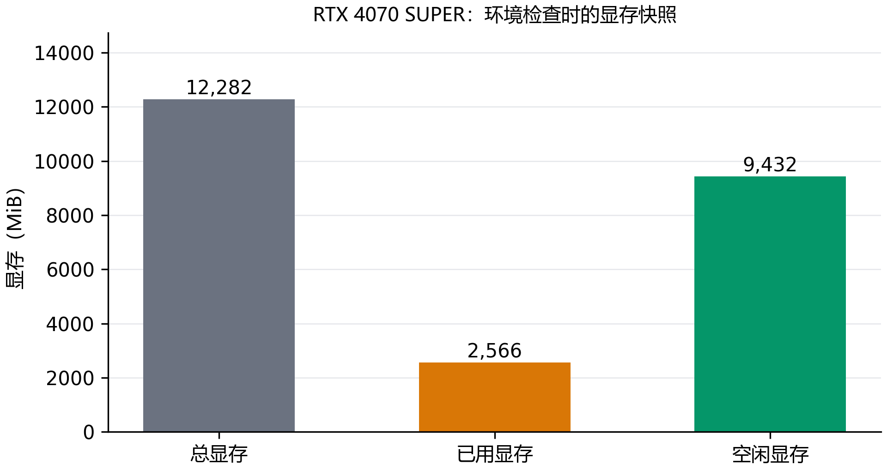

# E00：有显卡，为什么 Python 还是不能训练？

问题出在 PyTorch 安装包。本机原来的 Python 装了 CPU 版 PyTorch，显卡驱动能正常工作，Python 却用不上它。换到项目内的独立环境，安装带 CUDA 支持的版本后，GPU 才被 PyTorch 识别。原来的 Python 没有改动。

## 先分清驱动和 Python 的问题

看到 nvidia-smi 能列出显卡，很容易以为训练环境已经好了。它检查的是驱动；torch.cuda.is_available() 检查的是当前 Python 能否使用 CUDA。两边各查一次，问题就能定位到安装包，而不用先重装驱动。

| 检查项 | 实际结果 |
| --- | --- |
| 运行编号 | E00-R01 |
| 显卡与驱动 | NVIDIA GeForce RTX 4070 SUPER；591.86 |
| 原环境 PyTorch | 2.12.0+cpu，CUDA 不可用 |
| 独立环境 PyTorch | 2.8.0+cu128，识别 CUDA 12.8 |

## 下载和报告还遇到了什么？

下载公开资源时，第一次卡在 HTTPS 证书验证。改用 Windows 系统信任库后，请求成功了，全程保留证书校验。接着，Hub 下载接口缺少 HEAD 元数据，于是改成按固定版本直接 GET 下载，再核对来源提供的文件哈希。模型大文件的整包响应又等待过久，分段请求能够正常返回，便改用可续传的分段下载，最后仍核对整个文件的哈希。

报告也遇到了一次接口错误：Word 的应用对象没有预期的窗口句柄属性。改从已经打开的文档窗口读取句柄后，PDF 导出成功。随后查看实际页面，确认中文和图表能够正常显示。

## 12GB 显存，现在能用多少？

这次检查有 9,432 MiB 空闲显存。不过，这张图只记录一个时间点：桌面程序的占用会变，加载模型后还会增加激活、梯度和优化器状态。它可以帮助安排实验，不能提前证明某个模型一定练得动。

环境到这里解决了“Python 看不见显卡”的问题。接下来还要实际做前向和反向传播；只有计算和梯度正常，才适合继续模型训练。

复习时可以回看两个问题：nvidia-smi 成功为什么不等于 PyTorch 能使用 GPU？因为驱动和 Python 安装包是两层条件。空闲显存为什么不是固定预算？因为它会随其他程序和训练阶段变化，后续仍要测训练峰值。
