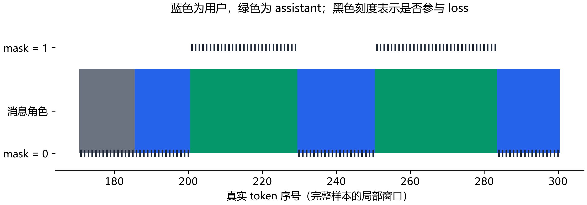

# E03：模型到底在学哪一段文字？

20 个模板检查样本已经通过：增加监督标记后，渲染文字和 token 都与官方模板一致；系统、用户和工具返回没有参与 loss，assistant 的结束 token 被保留为监督目标。

## 把一条对话展开看

训练时不能只看 messages 里的角色名。工具定义会进入系统提示，工具返回在 Qwen3 模板中又以用户消息包裹；它们最后都变成一串 token。监督遮罩决定哪些位置算错、产生梯度。

官方模板没有直接给出所需的 assistant 监督区间。本轮只在 assistant 分支加了 generation 标记，没有更换工具格式或改写提示。每条样本都同时渲染原模板和加标记模板，核对全文、token 序列和非思考推理前缀。

绿色位置的 mask 为 1，参与 loss；其余位置为 0，对应标签 -100。这里监督的是完整 assistant 消息，包含角色前缀和结束标记，不只是调用 JSON。原始逐 token 对照还能查看 token id、文本片段和标签。

## 20 条检查覆盖了什么？

样本包含单次、多轮、并行和不调用工具的记录，最长为 2040 token。另有一条从真实轨迹派生的空返回检查：只把工具返回改成空列表，用来确认遮罩仍然正确。它属于机制检查，不算真实执行或能力成绩。

E06 暴露多轮训练与当前轮推理的空 think 前缀差异后，又补查了每个 assistant 回复。按当前回复展开训练单元，逐条确认训练前缀与非思考推理前缀相同；此前的回复只作为上下文，当前回复和 EOS 才参与这一单元的 loss。
