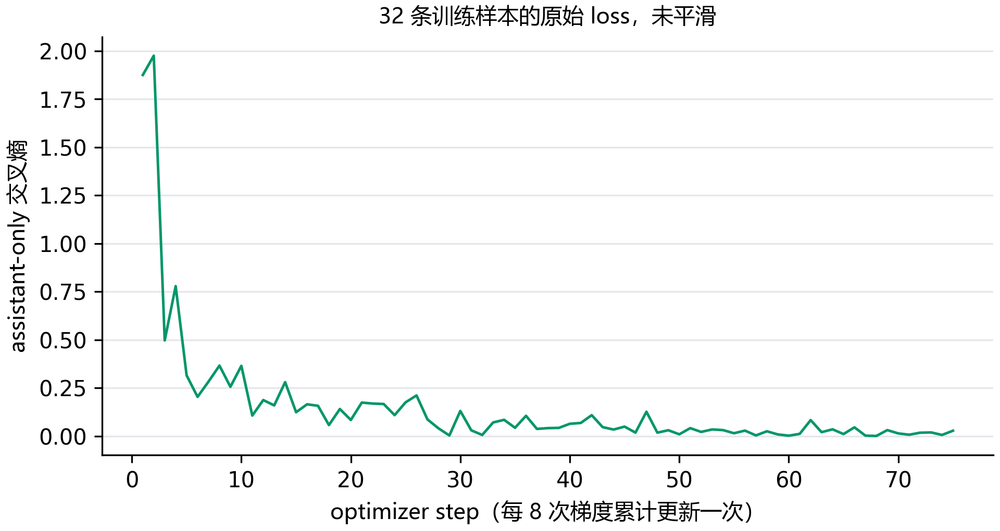

# E06：32 条样本，能不能真正学进去？

32 条训练轨迹中，最后有 31 条的全部工具调用通过严格检查，达到了这轮的 29/32 门槛。它说明训练链路能拟合这些样本，还不能说明模型学会了处理新任务。

## 为什么只用 32 条？

这里的小规模是排错手段。连训练样本都记不住时，直接扩大数据量很难判断是数据难、监督位置错，还是参数没有更新。32 条达到门槛后，还要继续 1k、5k、10k 的独立验证与测试比较。

样本包含 16 条单次调用、8 条多轮和 8 条并行调用。每条保留完整消息和工具定义。每轮检查工具调用时，输入使用该位置之前的标注历史；它没有执行真实工具，也不属于 Agent 成功率。

## 这一轮怎么训练

QLoRA 使用 NF4 权重和 BF16 计算，rank=16、alpha=32、dropout=0.05。学习率为 1e-4，每条样本单独前向，累计 8 次梯度后更新一次。每 25 次更新检查全部 32 条轨迹，最多更新 300 次。调用的工具名、参数与标注严格一致才算通过，截断或无法解析都计为失败。

参数更新的核心是这一段。inputs 是一个完整的当前回复单元，micro_batches 提供本次更新的 8 个单元。

```python
optimizer.zero_grad(set_to_none=True)
for inputs in micro_batches:
    with torch.autocast("cuda", dtype=torch.bfloat16):
        loss = model(**inputs).loss
    (loss / 8).backward()
torch.nn.utils.clip_grad_norm_(trainable, 1.0)
optimizer.step()
```

除以 8 对应这轮固定的梯度累积数；8 次反向才执行一次 optimizer.step，所以图上一个点是一次参数更新。

本轮运行编号为 E06-R02。

32 条独立轨迹展开成 88 个当前回复单元。每次前向使用一个单元，历史消息保留为输入，只有当前 assistant 回复参与 loss；轨迹数量没有增加到 88 条。

训练前通过 9/32，共检查 40 轮工具调用。这个起点很重要：后续不能把原模型已经会做的事情全算成微调的贡献。

## 第一轮 loss 很低，为什么还有回复不调用工具？

R01 的原模型起点是 9/32。第 25 次更新检查通过 25/32，第 50 次为 28/32；到第 74 次，训练 loss 已降到 0.000457，仍不能据此宣布通过。查看失败回复时，有些只说“我来帮你查询”，没有输出调用。

对比一个阶乘样本才看到差异：完整多轮训练的早期 assistant 直接接回复文字，当前轮推理前缀却多了空的 think 段。遮罩和梯度虽然正确，输入仍没有完全对齐。这也解释了为什么单看 loss 会误判。

R01 在确认差异后停止，训练日志、两次完整调用检查和 checkpoint 均保留。R02 仍使用同一批 32 条轨迹和官方模板，只把每条 assistant 回复展开成一个训练单元，前面的对话作为上下文，当前回复作为目标。实际前缀已经重新检查，手工 loss 和 LoRA 更新也重跑过了。

训练单元的分母改变了，所以两轮 loss 不直接比较大小。这里比较的是同 32 条完整轨迹能否复现全部标注调用。

## Loss 降了，调用也正确了吗？



目前记录了 75 次更新，第一步 loss 为 1.8749，最新为 0.0277。这是训练集曲线，不能当成验证集的泛化结果。

| 更新步数 | 完整轨迹通过数 |
| --- | --- |
| 25 | 27/32 |
| 50 | 28/32 |
| 75 | 31/32 |
