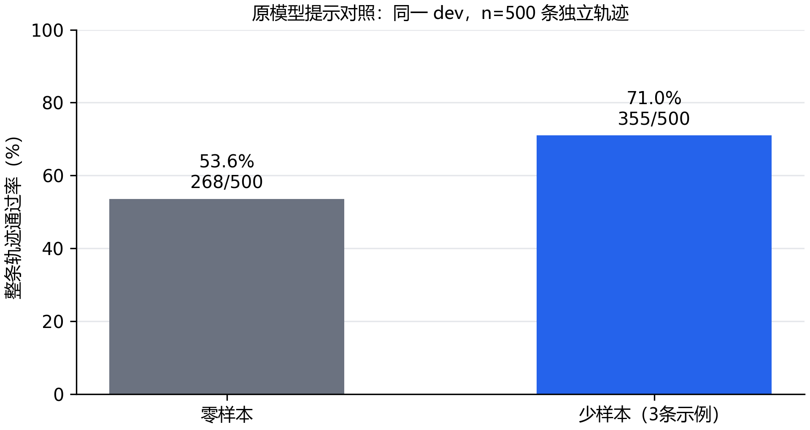

# E08：不训练，原模型能做到哪一步？

完整 dev 的 500 条轨迹中，三条示例的少样本提示通过 355/500，成为后续统一使用的评测提示。这个起点留好后，再看微调能增加多少正确调用；选择没有使用最终 test。

## 先留一个可信的起点

32 条拟合通过，只说明训练代码能把训练样本学进去。正式微调前，先让原模型回答从未用于训练的 dev。否则，后面看到的正确调用，很容易被全部归功于微调。

这轮比较两种提示。零样本沿用数据的通用系统提示；少样本增加三条来自 1k 训练集的示例，分别展示单次、并行和不调用工具。示例包含自己的工具定义，并明确说明那些工具不能拿来处理当前任务。两种提示都保留当前任务的完整工具列表和历史。

## 500 条轨迹，怎样算通过？

每次工具调用都检查。紧接用户的无调用回复也检查，防止模型遇到任何问题都硬调工具；工具返回后的普通总结不重复充当“无调用成功”。输入使用该轮之前的标注历史，因此这里测的是工具决策，还没有执行真实工具。

单轮通过需要工具名和参数都符合标注，且生成没有截断、超时或解析错误。一个回复里的并行调用按无序多重集合比较；一条轨迹的所有决策都通过，整条才通过。输出上限 1024 token，上下文预算 8192，贪心解码，一批 4 条。超限和失败留在分母里。

本轮为 E08-R01。少样本示例固定在开始时，不随 dev 的错误换题；两种提示结束后按轨迹通过数选择，平局选较短的零样本提示。

生成时显式关闭采样，下面是实际参数中的核心几项。inputs 已通过官方模板渲染，并使用非思考前缀。

```python
output = model.generate(
    **inputs, do_sample=False, use_cache=True,
    max_new_tokens=1024,
    temperature=None, top_p=None, top_k=None,
)
```

这样固定生成策略，是为了让两种提示和后续模型接受同样的比较条件。

## 已完成的比较

| 提示 | 完整轨迹通过 | 工具调用轮通过 | 不调用轮通过 | 截断 |
| --- | --- | --- | --- | --- |
| zero_shot | 268/500 | 315/568 | 355/360 | 0 |
| few_shot | 355/500 | 456/568 | 299/360 | 0 |



少样本比零样本多通过 87 条，相差 17.4 个百分点。这是本 dev 的实际差值，后续固定选择的提示，再让训练条件接受同样的检查。并行类别只有 10 条，分类成绩需要结合这个样本量看。

示例让模型更愿意调用工具：调用轮从 315/568 提高到 456/568。代价也很明显，不调用轮从 355/360 降到 299/360。后面不能只盯着总体通过率，还要看微调能否减少这种过度调用。

## JSON 能解析，为什么仍然判错？

例如，glaive-60626 的用户只说想往待办清单加任务，还没有给具体任务和优先级。标注要求先询问，少样本提示下模型却直接输出了下面的调用。这是本轮实际回复，格式检查通过，任务判断却错了。

```json
{
  "name": "make_todo",
  "arguments": {
    "task": "I need to add a task to my todo list.",
    "priority": "medium"
  }
}
```

模型把“想加任务”这句话当成了任务内容，又自行填了 medium 优先级。因此，可解析 JSON 和正确工具选择还不够，参数也要能从请求或工具返回中找到依据。
