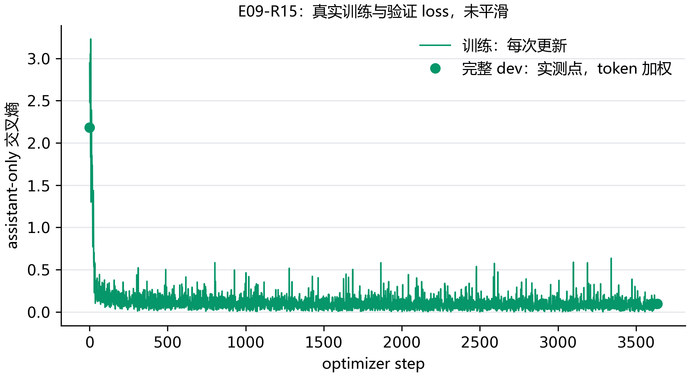
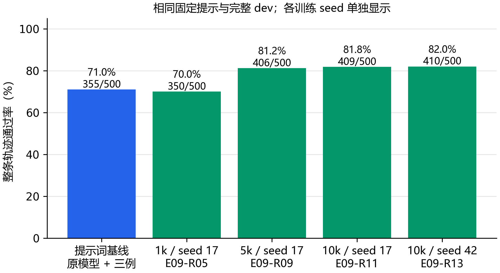
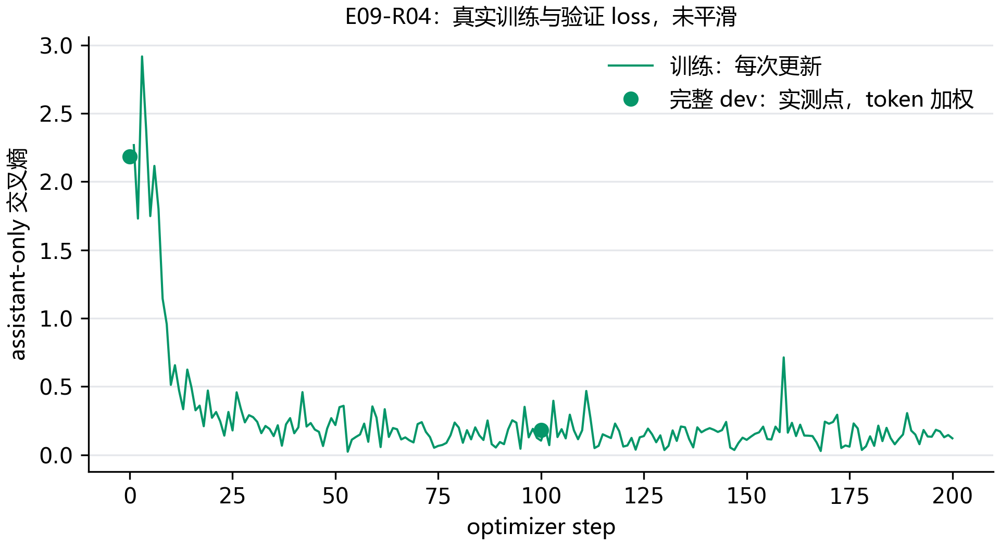

# E09：从 1k 到 10k，模型学到的是格式还是任务？

这轮用了 10,000 条训练轨迹，完整 dev 通过 410/500；原模型加固定示例为 355/500。调用轮相差 +36 条，不调用轮相差 +39 条。先把这两类决策分开，才看得清模型具体改变了什么；其余规模和 seed 仍需继续比较。

## 先把数据量和训练量分清楚

1k、5k、10k 表示独立轨迹数量。每条轨迹展开为多个当前回复单元，原有的完整历史和工具定义都保留，只监督当前 assistant；因此一个 epoch 是全部展开单元各参与一次训练。三个训练集嵌套，但 token 数、参数更新次数也随数据增加，这个实验比较的是扩大数据后的整体效果。

这轮使用 TRL SFTTrainer、PEFT 和 NF4 QLoRA，BF16 混合精度，packing 关闭。初始 rank=16、alpha=32、dropout=0.05，单卡每次一条，累计 8 次梯度后更新。AdamW 学习率从 warmup 升到 1e-4，再线性下降，warmup 比例 3%，梯度裁剪为 1.0。训练只跑一个 epoch，不因 loss 好看而追加轮数。

实际训练参数中，与监督和更新频率直接有关的是这些：

```python
training_args = SFTConfig(
    output_dir=str(run_directory),
    num_train_epochs=1,
    assistant_only_loss=True, packing=False,
    per_device_train_batch_size=1,
    gradient_accumulation_steps=8,
    learning_rate=1e-4, warmup_ratio=0.03,
    bf16=True, eval_steps=100, save_steps=100,
    dataset_kwargs={"skip_prepare_dataset": True},
)
```

这里跳过的是重复预处理：输入和 labels 已经逐条生成并检查，Trainer 读取这些真实 token；assistant-only 没有被改成全文 loss。其余优化器、检查点和保存参数也保存在运行配置里。

训练保留数据本身的通用系统提示。工具生成评估沿用 E08 在 dev 选择的固定提示；所有模型使用同一种评测条件。训练记录中明确保存这两个提示条件。

## checkpoint 为什么不能只看训练 loss？

每 100 次更新检查全部 500 条 dev 的所有当前回复，最后不足 100 步的一段也检查。验证交叉熵按实际监督 token 数加权；不把长回复和短回复的平均 loss 简单再平均。最低完整 dev loss 的 checkpoint 被选中，平局保留更早者。最终 test 不参与选择。

loss 选择结束后，还要真正生成工具调用。即使 dev loss 下降，也可能出现少调用、参数猜测或多轮错误，所以完成训练和完成泛化评测是两个状态。

## 目前实际运行了什么？

| 运行 | 独立轨迹 | seed | 当前步数 | 最佳 checkpoint 的 dev loss | 状态 |
| --- | --- | --- | --- | --- | --- |
| E09-R01 | 1000 | 17 | 0 | 尚未保存 | 失败，保留记录 |
| E09-R03 | 1000 | 17 | 22 | 尚未保存 | 显存压力，停止并保留记录 |
| E09-R04 | 1000 | 17 | 200 | 0.18030 | 显存压力，停止并保留记录 |
| E09-R05 | 1000 | 17 | 363 | 0.14346 | 训练与完整 dev 工具评测结束 |
| E09-R07 | 5000 | 17 | 100 | 尚未保存 | 失败，保留记录 |
| E09-R09 | 5000 | 17 | 1813 | 0.10856 | 训练与完整 dev 工具评测结束 |
| E09-R11 | 10000 | 17 | 3635 | 0.09608 | 训练与完整 dev 工具评测结束 |
| E09-R13 | 10000 | 42 | 3634 | 0.09616 | 断点恢复后训练与完整 dev 工具评测结束 |
| E09-R15 | 10000 | 2026 | 3635 | 0.09625 | 训练完成，待工具评测 |

当前运行展开 29,073 个回复单元，共 1,282,656 个监督 token；最长 2040 token。全部单元已检查官方渲染、非思考前缀和监督位置，没有截断调用。

## 10k seed 42 这一轮为什么停在半路？

E09-R13 跑到第 489 次参数更新时，训练日志没有 Python traceback 或 CUDA OOM 记录。Windows 在同一秒留下了重启事件：由 StartMenuExperienceHost 发出重启请求，训练子进程随后以 `0x40010004` 结束。系统事件与训练日志的时间能对上。

最后一次完整 dev 检查在第 400 步，loss 为 0.14347。保存的 `checkpoint-400` 有 16 个文件，清单里的 SHA-256 都已复核；第 401—489 步没有 checkpoint，不能算进已保存训练量。恢复时沿用这份 10k、seed 42 配置和同一运行号：

```powershell
python scripts/sft.py --config configs/sft.json --experiment E09 --size 10000 --seed 42 --resume-run E09-R13
```

这次只是系统重启后的断点续训，不是换参数重跑。重启原因、最后日志、队列报错和 checkpoint 校验结果均保留在本地运行档案。



训练点是 TRL 每次参数更新的 loss，验证点来自完整 dev 的监督 token 加权交叉熵。它们的聚合窗口不同，先观察各自趋势，再结合工具生成结果判断；不能把一两个低点当成能力改善。

已完成的 1k 主运行共有 2,900 个回复单元、126,688 个监督 token，更新 363 次。完整 dev loss 从 2.18203 降到 0.14346，选择了 checkpoint-363。下面的生成结果才用来检查，这种对标注文本的拟合是否变成了更可靠的决策。

5k 的 E09-R09 也完成了一个epoch，14,502 个回复单元共有 638,598 个监督 token，实际更新 1,813 次。最低完整 dev loss 为 0.10856，选择 checkpoint-1813；参数训练耗时 2.85 小时，包含中途完整验证与保存。选中适配器的同一500条dev工具生成评测也已完成，下面结合实际回复判断规模变化。

这一步要观察两条线：训练 loss 是否继续下降，完整 dev loss 是否也下降。只有两条线和工具结果放在一起，才有依据区分记住训练内容与适应新任务。

## 生成评测进行到哪一步？

E09-R15 的独立生成评测为 E09-R16，已落盘 448/928 个决策轮。还没有覆盖完整 500 条轨迹，暂时不把当前通过数写成最终成绩。


## loss 降下来了，工具调用也改善了吗？

最近完成的 E09-R13 通过 410/500；调用轮为 492/568，不调用轮为 338/360。是否比原模型好，要在相同条件下逐项比较。

这里只列已经完成全部 dev 的运行。原模型和适配器使用 E08 选择的同一提示、贪心解码、相同标注历史和生成预算；每一项都可以核对逐条回复，失败仍留在分母中。

| 训练运行 | 数据量 / seed | 整条轨迹通过 | 调用轮通过 | 不调用轮通过 | 截断 |
| --- | --- | --- | --- | --- | --- |
| 原模型，固定提示 | 无微调 | 355/500 | 456/568 | 299/360 | 0 |
| E09-R05 | 1,000 / 17 | 350/500 | 474/568 | 276/360 | 1 |
| E09-R09 | 5,000 / 17 | 406/500 | 482/568 | 342/360 | 1 |
| E09-R11 | 10,000 / 17 | 409/500 | 490/568 | 335/360 | 1 |
| E09-R13 | 10,000 / 42 | 410/500 | 492/568 | 338/360 | 1 |



最近完成的 E09-R13 通过 410/500，与原模型相差 +55 条，即 +11.0 个百分点。调用轮相差 +36 条，不调用轮相差 +39 条。先分别看这两类决策，才能判断模型是否只是更愿意调工具。

这些仍是 dev 成绩，用于探索规模与选配置；最终 test 还没有用于本阶段选择。数据更多也意味着监督 token 和更新次数更多，规模差异不能直接归因于某一种训练机制。

## 只少通过五条，是原来的题都差了一点吗？

不是。1k 这轮和提示词基线有 317 条共同通过、112 条共同失败；另外 33 条原来错的轨迹被修好，38 条原来对的轨迹退步了。最后相差五条，是这两边变化抵消后的结果。逐轮看也有 47 次改对和 52 次改错，不能说模型几乎没有变化。

把同一批 500 条轨迹成对重抽 10,000 次，差值的 95% 区间为 -4.4 到 +2.2 个百分点，覆盖零。这里先把结论收住：本轮没有证明整体改善，也没有充分依据把这一点差距推广为稳定退步。区间只反映这份 dev 的轨迹差异，不包含重新训练不同 seed 的波动。

## 是不是每个缺参数的问题都变差了？

也不是。上一节的待办例子 glaive-60626，这轮已经改成先询问任务和优先级；原模型猜参数的问题得到了修正。但 glaive-19711 只说想听音乐，没有给出类型，原模型会问想听什么，微调后却直接调用了下面的工具：

```json
{"name":"play_music","arguments":{"genre":"pop"}}
```

这条 JSON 和参数类型都有效，问题在于 pop 是模型自行补出的。两个例子都来自本轮实际回复。接下来继续原定 5k、10k 比较，观察这种多调用、少询问的倾向是否改变；数据质量和学习率的对照再单独排查，当前不为了让成绩变好而改评分。

## 增加到5k后，哪些轨迹变了？64条修好，13条退步

和固定提示的原模型相比，5k 这轮有 342 条共同通过、81 条共同失败；64 条原来错的轨迹被修好，13 条原来对的轨迹退步，净增加51条。按同一500条轨迹配对重抽10,000次，提升的95%区间为 7.0—13.6 个百分点。这次区间没有覆盖零，可以说这份dev上有改善；它仍不能代表最终test，也没有包含不同训练seed的波动。

变化主要体现在不调用的决策：5k通过342/360，1k只有276/360；调用轮则从474/568变为482/568。模型更能等参数补齐，但并行任务仍只有2/10条轨迹通过。数据量、监督token和更新次数都增加了，暂时不能把原因单独归到某一种训练机制。

待办任务 glaive-60626 很适合说明这轮的变化。用户只说想加一条待办时，5k模型会先询问内容和优先级，修正了原模型自行猜参数的问题。但在补齐“buy groceries”和“high”后的另一个决策轮，它返回了下面的调用：

```json
{"name":"make_todo","arguments":{"priority":"high","task":"Buy groceries"}}
```

标注里的任务内容是小写的“buy groceries”。这次只改了首字母，仍被既定的严格字符串评分判为失败，所以整条轨迹没有通过。这不是缺参数错误，却也不能临时放宽评分把它算对。一个决策改好了，不代表整条轨迹都修好了。这里各轮输入使用标注历史，尚未执行模型自己的连续Agent对话；接着完成原定10k和三个训练seed，再看收益是否稳定。

## 第一次反向为何没有梯度？

R01 已完整算出初始 dev loss 2.18203，但第一次反向失败。R02 单独复现了边界：手动准备的 LoRA 有 17,432,576 个可训练参数，交给 TRL 的准备函数后变为 0，loss 也不再带梯度。原因是这版 TRL 又调用了一次 k-bit 准备，冻结了已经添加的适配器。

后续把裸 NF4 模型和 LoRA 配置一起交给 Trainer，让它先准备基础权重再创建适配器；构造结束时核对可训练参数。失败和单独复现的记录都保留，正式训练使用新的运行号，不改数据量和监督方式。

## 梯度恢复了，为什么每一步又变得很慢？

R03 已经有有效梯度，但约第 18 次更新开始，单步耗时的中位数达到 54.1 秒。停止前实际记录的整卡占用为 11,818 MiB，运行中的张量峰值却只有约 3,068—3,718 MiB。停止本项目进程后，整卡占用回到 1,026 MiB。这轮保留已有更新，但没有到第一次 checkpoint，不计作完成训练。

下一轮 R04 把张量分配量和缓存保留量分开记录，并在更新前释放未使用缓存。模型参数、梯度和优化器状态仍在；轨迹数量、seed、学习率和更新次数都没有改变。这是新的资源条件，不能把两轮耗时直接合成一次训练。

R04 已记录第 18—200 次更新，这段训练单步中位数为 2.97 秒；本段最大缓存保留量为 12.21 GiB。训练阶段恢复了正常步时，完整流程还需要看验证阶段。

排查时要分开看这几个数。allocated 是仍被张量使用的显存，reserved 还包含分配器保留的缓存；只记录其中一个，容易看漏资源压力。

```python
allocated = torch.cuda.memory_allocated()
reserved = torch.cuda.memory_reserved()
# 释放没有张量占用的缓存，不释放模型权重
torch.cuda.empty_cache()
```

## 验证还在慢，训练阶段的调整够了吗？

还不够。R04 第 100 步完整 dev loss 为 0.18030，checkpoint 也已保存；第 200 步验证又累积缓存，停止前整卡占用 11,769 MiB。第 200 步没有完整验证结果，因此图中没有补上这个点，也没有把这轮写成训练完成。

R05 重新从同一官方学生开始训练，同时在每个验证回复结束后释放空闲缓存，单独记录释放前后占用。计算仍覆盖全部 500 条轨迹的 1,484 个回复，按相同监督 token 加权。这次改变针对资源管理，样本量、目标标签和评分方式都保持原定条件。



## 这次没有 OOM，为什么 5k 还是停了？

R07 已训练 100 次，完整 dev loss 为 0.18383；模型计算和验证都已完成，随后替换进度记录时出现 WinError 5。失败发生在保存 checkpoint 之前，因此这一轮没有可恢复的模型断点，不能把完成验证当成完成训练。已有 100 次更新、两次完整 dev 测量和原始报错全部保留。

R08 用真实 Windows 文件句柄复现了边界：文件还被读取时，旧写法替换失败；关闭读句柄后，同一替换成功。原失败时具体是哪一个进程持有句柄还没有确认，不能直接归因到某个程序。

新的写法让各次写入使用独立临时文件，在短暂占用时有限重试。实际核验中，读句柄在 0.20 秒后释放，替换在 0.31 秒后成功，读取到的内容正确；持续无法写入仍会报错。后续按同样 5k 数据、seed 和训练参数重新开始，改动针对记录写入，不减少训练量。
