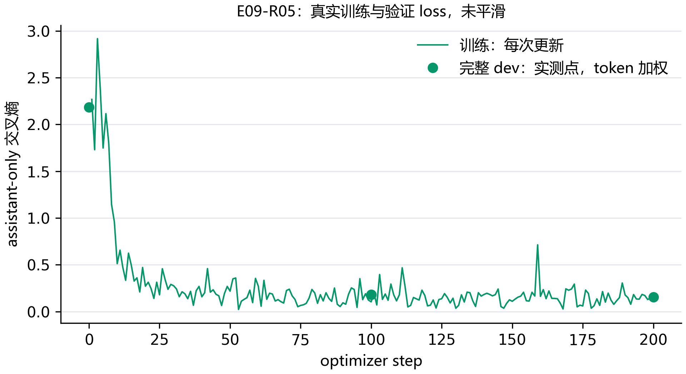

# E09：从 1k 到 10k，模型学到的是格式还是任务？

正式微调还没有完成规模比较，暂时不能判断增加数据是否有用。当前先训练 1k，再以相同主要配置完成 5k 和 10k；dev loss 与工具生成结果分别保留。

## 先把数据量和训练量分清楚

1k、5k、10k 表示独立轨迹数量。每条轨迹展开为多个当前回复单元，原有的完整历史和工具定义都保留，只监督当前 assistant；因此一个 epoch 是全部展开单元各参与一次训练。三个训练集嵌套，但 token 数、参数更新次数也随数据增加，这个实验比较的是扩大数据后的整体效果。

这轮使用 TRL SFTTrainer、PEFT 和 NF4 QLoRA，BF16 混合精度，packing 关闭。初始 rank=16、alpha=32、dropout=0.05，单卡每次一条，累计 8 次梯度后更新。AdamW 学习率从 warmup 升到 1e-4，再线性下降，warmup 比例 3%，梯度裁剪为 1.0。训练只跑一个 epoch，不因 loss 好看而追加轮数。

实际训练参数中，与监督和更新频率直接有关的是这些：

```python
training_args = SFTConfig(
    output_dir=str(run_directory),
    num_train_epochs=1,
    assistant_only_loss=True, packing=False,
    per_device_train_batch_size=1,
    gradient_accumulation_steps=8,
    learning_rate=1e-4, warmup_ratio=0.03,
    bf16=True, eval_steps=100, save_steps=100,
    dataset_kwargs={"skip_prepare_dataset": True},
)
```

这里跳过的是重复预处理：输入和 labels 已经逐条生成并检查，Trainer 读取这些真实 token；assistant-only 没有被改成全文 loss。其余优化器、检查点和保存参数也保存在运行配置里。

训练保留数据本身的通用系统提示。工具生成评估沿用 E08 在 dev 选择的固定提示；所有模型使用同一种评测条件。训练记录中明确保存这两个提示条件。

## checkpoint 为什么不能只看训练 loss？

每 100 次更新检查全部 500 条 dev 的所有当前回复，最后不足 100 步的一段也检查。验证交叉熵按实际监督 token 数加权；不把长回复和短回复的平均 loss 简单再平均。最低完整 dev loss 的 checkpoint 被选中，平局保留更早者。最终 test 不参与选择。

loss 选择结束后，还要真正生成工具调用。即使 dev loss 下降，也可能出现少调用、参数猜测或多轮错误，所以完成训练和完成泛化评测是两个状态。

## 目前实际运行了什么？

| 运行 | 独立轨迹 | seed | 当前步数 | 最佳 checkpoint 的 dev loss | 状态 |
| --- | --- | --- | --- | --- | --- |
| E09-R01 | 1000 | 17 | 0 | 尚未保存 | 失败，保留记录 |
| E09-R03 | 1000 | 17 | 22 | 尚未保存 | 显存压力，停止并保留记录 |
| E09-R04 | 1000 | 17 | 200 | 0.18030 | 显存压力，停止并保留记录 |
| E09-R05 | 1000 | 17 | 200 | 0.15433 | 运行中 |

当前运行展开 2,900 个回复单元，共 126,688 个监督 token；最长 1945 token。全部单元已检查官方渲染、非思考前缀和监督位置，没有截断调用。



训练点是 TRL 每次参数更新的 loss，验证点来自完整 dev 的监督 token 加权交叉熵。它们的聚合窗口不同，先观察各自趋势，再结合工具生成结果判断；不能把一两个低点当成能力改善。

这一步要观察两条线：训练 loss 是否继续下降，完整 dev loss 是否也下降。只有两条线和工具结果放在一起，才有依据区分记住训练内容与适应新任务。

## 第一次反向为何没有梯度？

R01 已完整算出初始 dev loss 2.18203，但第一次反向失败。R02 单独复现了边界：手动准备的 LoRA 有 17,432,576 个可训练参数，交给 TRL 的准备函数后变为 0，loss 也不再带梯度。原因是这版 TRL 又调用了一次 k-bit 准备，冻结了已经添加的适配器。

后续把裸 NF4 模型和 LoRA 配置一起交给 Trainer，让它先准备基础权重再创建适配器；构造结束时核对可训练参数。失败和单独复现的记录都保留，正式训练使用新的运行号，不改数据量和监督方式。

## 梯度恢复了，为什么每一步又变得很慢？

R03 已经有有效梯度，但约第 18 次更新开始，单步耗时的中位数达到 54.1 秒。停止前实际记录的整卡占用为 11,818 MiB，运行中的张量峰值却只有约 3,068—3,718 MiB。停止本项目进程后，整卡占用回到 1,026 MiB。这轮保留已有更新，但没有到第一次 checkpoint，不计作完成训练。

下一轮 R04 把张量分配量和缓存保留量分开记录，并在更新前释放未使用缓存。模型参数、梯度和优化器状态仍在；轨迹数量、seed、学习率和更新次数都没有改变。这是新的资源条件，不能把两轮耗时直接合成一次训练。

R04 已记录第 18—200 次更新，这段训练单步中位数为 2.97 秒；本段最大缓存保留量为 12.21 GiB。训练阶段恢复了正常步时，完整流程还需要看验证阶段。

排查时要分开看这几个数。allocated 是仍被张量使用的显存，reserved 还包含分配器保留的缓存；只记录其中一个，容易看漏资源压力。

```python
allocated = torch.cuda.memory_allocated()
reserved = torch.cuda.memory_reserved()
# 释放没有张量占用的缓存，不释放模型权重
torch.cuda.empty_cache()
```

## 验证还在慢，训练阶段的调整够了吗？

还不够。R04 第 100 步完整 dev loss 为 0.18030，checkpoint 也已保存；第 200 步验证又累积缓存，停止前整卡占用 11,769 MiB。第 200 步没有完整验证结果，因此图中没有补上这个点，也没有把这轮写成训练完成。

R05 重新从同一官方学生开始训练，同时在每个验证回复结束后释放空闲缓存，单独记录释放前后占用。计算仍覆盖全部 500 条轨迹的 1,484 个回复，按相同监督 token 加权。这次改变针对资源管理，样本量、目标标签和评分方式都保持原定条件。


