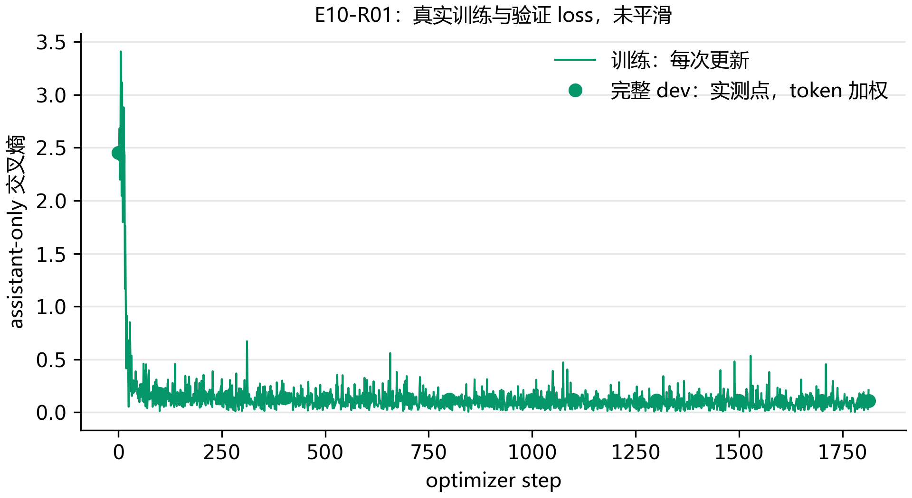

# E10：QLoRA 省了多少显存，效果是否变化？

两组已完成相同完整 dev：NF4 训练通过 406/500，BF16 训练通过 403/500，相差 -3 条。先看训练成本和两类决策，再解释精度的影响。

## 怎样让这个比较尽量公平？

两组使用相同的 5,000 条轨迹、14,502 个回复单元和 638,598 个监督 token。seed 为 17，rank=16、alpha=32、dropout=0.05；学习率为 1e-4，单卡 batch=1，累积 8 次梯度，训练一个 epoch，共 1,813 次更新。NF4 参考沿用已完成的 E09 运行，没有为了这个对照再训练一遍。

主变量是基础权重以 BF16 还是 NF4 存储。量化模型需要 k-bit 准备，普通模型走正常 PEFT 分支；库还可能改变适配器和非量化层的 dtype，所以它是两套实际训练方案的比较，不能把所有差异都归因于四位编码。下面记录实际可训练参数和 dtype。

```python
options = dict(torch_dtype=torch.bfloat16, device_map={"": 0})
if load_in_4bit:
    options["quantization_config"] = BitsAndBytesConfig(
        load_in_4bit=True, bnb_4bit_quant_type="nf4",
        bnb_4bit_use_double_quant=True,
        bnb_4bit_compute_dtype=torch.bfloat16,
    )
```

`load_in_4bit` 是存储方式开关；`options` 传给同一个官方模型加载入口。无论哪一组，模型都交给 TRL 准备后再添加 LoRA，模板、监督位置和缓存释放方式保持一致。

| 运行 / 存储方式 | 可训练参数 | 适配器 dtype | 基础层 dtype |
| --- | --- | --- | --- |
| E09-R09 / NF4 | 17432576 | torch.float32 | 原参考未另记此项 |
| E10-R01 / BF16 | 17432576 | torch.float32 | torch.bfloat16 |

## 训练省下了哪些资源？

显存表来自训练更新时 PyTorch 实际记录的数值；allocated 表示张量占用，reserved 还包含分配器保留的缓存。更新耗时包括该步计算与缓存释放，不含后续完整验证和 Word 整理。失败条件只列已有测量，不把缺失的最终成绩写成零。

| 运行 | 已记录更新 | 更新耗时中位数（s） | 最大 allocated / reserved（MiB） | 训练状态 |
| --- | --- | --- | --- | --- |
| E09-R09 | 1813 | 3.01 | 7918 / 15472 | 一个 epoch 已完成 |
| E10-R01 | 1813 | 2.52 | 9698 / 17048 | 一个 epoch 已完成 |

| 运行 | 训练循环耗时（s） | 监督 tokens/s | 最低完整 dev loss |
| --- | --- | --- | --- |
| E09-R09 | 10272 | 62.17 | 0.10856 |
| E10-R01 | 8725 | 73.19 | 0.10641 |

训练循环耗时使用 Trainer 的实际计时，包含循环内完整验证和报告回调，不含模型加载及训练前验证；监督吞吐按本轮真实目标 token 总数除以这段耗时计算，不能与纯推理 tokens/s 混用。



训练和验证 loss 分别保留原始测量。验证覆盖全部 500 条轨迹的 1,484 个回复，按 66,664 个监督 token 加权；缺失的验证点不插值补齐。

## 训练精度不同，生成评测也一起改吗？

这一步的生成后端保持一致：两组适配器都加载到相同 NF4 学生，用固定提示、标注历史和贪心解码评测。这样比较的是训练后适配器的变化；BF16 推理本身的质量和速度另做部署实验。

| 训练运行 | 完整轨迹通过 | 调用轮通过 | 不调用轮通过 | 截断 |
| --- | --- | --- | --- | --- |
| E09-R09 | 406/500 | 482/568 | 342/360 | 1 |
| E10-R01 | 403/500 | 468/568 | 349/360 | 0 |
