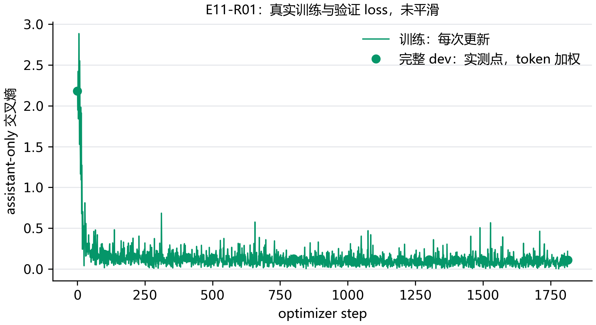
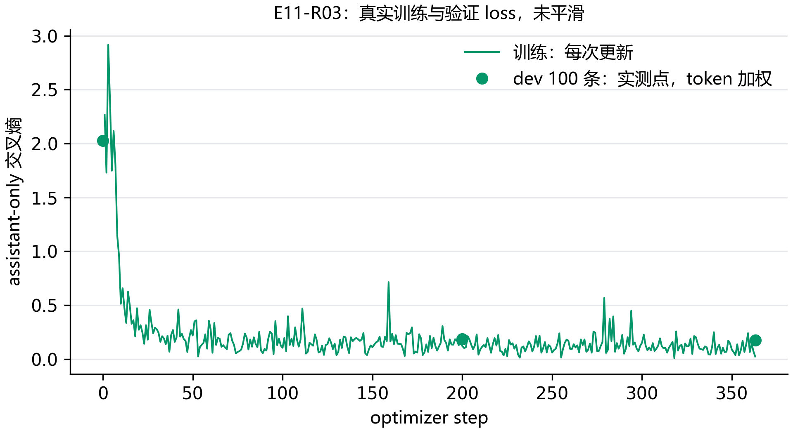
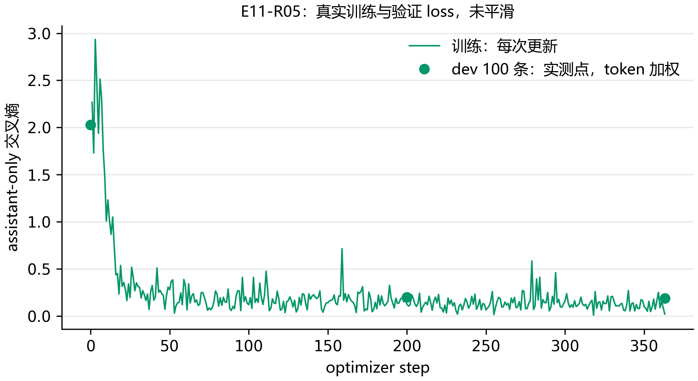
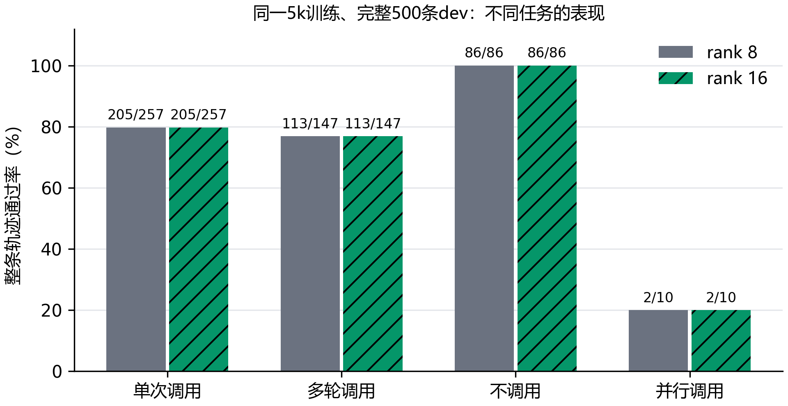

# E11：rank 翻倍，能学得更好吗？

这次把 rank 从 8 增到 16，没有提高整条轨迹的通过数：两组都通过 406/500。可训练参数翻倍，模型的具体错误却有变化。这个结果说明，增加适配器容量未必就能把工具任务做好；不能只凭 loss 或参数量判断效果。

## 先确认增加了多少参数

读取本地学生权重文件的投影形状，找到了 196 个目标矩阵。LoRA 为每个矩阵增加 A 和 B 两个矩阵，因此共有 392 个适配器张量。对于输出维度为 m、输入维度为 n 的线性层，新增参数量是 r×(m+n)。这里读取的是权重元数据，没有把模型放到 GPU 上。

```python
parameters = sum(rank * (out_dim + in_dim)
                 for out_dim, in_dim in projection_shapes)
```

| rank | 由实际权重形状计算的适配器参数量 | alpha | alpha/r |
| --- | --- | --- | --- |
| 8 | 8,716,288 | 32 | 4 |
| 16 | 17,432,576 | 32 | 2 |
| 32 | 34,865,152 | 32 | 1 |

rank 16 的计算结果是 17,432,576，与 E09 的实际可训练参数统计一致。E11-R01 接入训练后，rank 8 实际为 8,716,288 个参数，也与计算相符。rank 32 这里只列形状计算，尚无训练成绩。在 alpha 固定为 32 时，alpha/r 也随 rank 改变，所以比较的是整套 rank 设置，不能把变化全部归因于参数量。

## 怎么安排，才能看出是哪一个变量起作用？

rank 对照把学习率固定为 1e-4，比较 rank 8 和 16。两组使用同一份 5,000 条轨迹、14,502 个当前回复单元和 638,598 个监督 token，seed 17，一个 epoch、1,813 次更新；长度、模板、监督遮罩和缓存策略一致。rank 16 复用 E09 的同条件训练与全部 500 条 dev 工具结果。

学习率实验另用同一份 1,000 条训练轨迹，固定 rank 16，比较 1e-4 和 5e-5。两组都重新训练，使用同一份预先冻结的 100 条 dev，初始、每 200 步及末步计算 token 加权 loss，按最低 loss 选 checkpoint。随后在这 100 条轨迹上生成工具决策；通过数相同就选较低学习率。这里比较学习率，不把它和 5k rank 实验拼成同一组提升。最终 test 不参与选择。

## 第一次启动为什么停了？

第一次启动队列时使用了系统默认 Python，训练子进程在导入 `datasets` 时以 `ModuleNotFoundError` 退出，退出码为 1。错误发生在训练初始化阶段，没有创建训练状态、加载模型或占用 GPU。随后改用项目锁定的训练环境启动 E11-R01；这次失败属于解释器入口问题，不是 rank 条件跑坏了。

## 目前哪些条件已经实际运行？

| 运行 | 训练轨迹 | rank | 学习率 | 更新次数 | 状态 |
| --- | --- | --- | --- | --- | --- |
| E09-R09 | 5,000 | 16 | 0.0001 | 1813 | 参考；训练与工具评测完成 |
| E11-R01 | 5,000 | 8 | 0.0001 | 1813 | 训练与工具评测完成 |
| E11-R03 | 1,000 | 16 | 0.0001 | 363 | 训练与工具评测完成 |
| E11-R05 | 1,000 | 16 | 5e-05 | 363 | 训练与工具评测完成 |







## 工具表现怎样？

表中分母来自各自冻结清单。5k rank 实验使用完整 500 条 dev；1k 学习率实验使用固定抽样的 100 条，四类任务都保留，其中并行调用保留原 dev 的全部 10 条。两套分数分开解释，抽样结果只说明这些任务上的表现。各条件沿用固定提示、贪心解码和同一 NF4 推理后端。

| 训练运行 | 训练轨迹 | rank | 学习率 | 整条轨迹 | 调用轮 | 不调用轮 | 截断 |
| --- | --- | --- | --- | --- | --- | --- | --- |
| E09-R09 | 5,000 | 16 | 0.0001 | 406/500 | 482/568 | 342/360 | 1 |
| E11-R01 | 5,000 | 8 | 0.0001 | 406/500 | 477/568 | 346/360 | 0 |
| E11-R03 | 1,000 | 16 | 0.0001 | 68/100 | 86/112 | 59/72 | 0 |
| E11-R05 | 1,000 | 16 | 5e-05 | 63/100 | 84/112 | 56/72 | 1 |

学习率比较只看这份固定的 100 条 dev：1e-4 通过 68 条，5e-5 通过 63 条，前者多 5 条。调用轮分别通过 86/112 和 84/112，不调用轮为 59/72 和 56/72；最低 token 加权 dev loss 分别为 0.1764 和 0.1888。按预先定下的整条轨迹通过数，当前应选 1e-4。这个差距来自同一冻结子集上的单 seed 对照，不能外推为全量成绩或稳定的随机种子结论。

rank 8 的调用轮通过 477/568，rank 16 为 482/568；不调用轮分别为 346/360 和 342/360。总通过数相同，不能理解成两个模型输出完全一样。当前结果来自 seed 17 的一次对照，尚不能推广成所有训练随机种子的结论。

逐条配对后，两组共同通过 401 条，各有 5 条和 5 条是只有自己通过的任务。总体分数打平，并不意味着增加 rank 完全没有改变模型，只是这次变化没有增加通过的任务总数。

一个具体错误出现在发票任务 `glaive-19894`。用户给出的客户、商品单价和数量都被 rank 8 正确写入调用，但它还在 arguments 中多写了 `type` 字段。rank 16 的同一条回复没有这个字段，因而通过严格的参数匹配。下面摘出多写的参数，完整调用保留在逐条结果中。

```json
{"type": "function"}
```


四类题的通过数在两组中也完全相同：单次调用 205/257、多轮调用 113/147、不调用 86/86、并行调用 2/10。逐条配对仍能看到各自多出的 5 条表现落在不同任务上，只是没有改变本批数据的类别合计。并行类只有 10 条，比例对少数样本很敏感。
