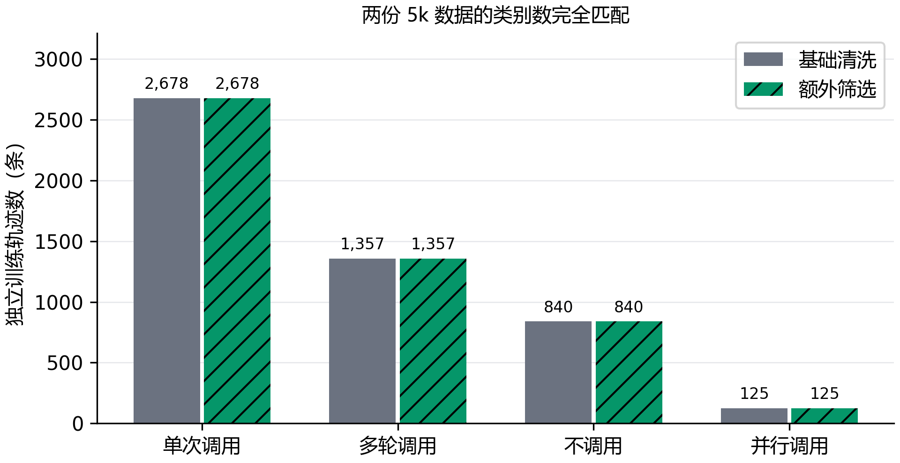
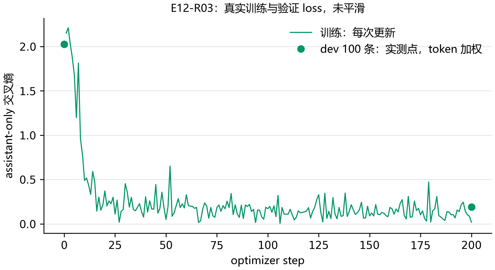

# E12：筛得更严格，数据就一定更好吗？

目前只能确认数据条件，效果还要等训练。两份数据都保留 5,000 条独立轨迹，来源和四类任务数量一致；额外筛选保留原来的 4,326 条，替换 674 条。抽查同时发现了误删和漏检，因此这里的“通过筛选”只表示符合固定规则。

## 第一版为什么不能直接拿去训练？

第一轮从既有训练区的 19,040 个任务组中选出了 5,000 条。逐条检查 25 条通过和 25 条剔除样本时，发现数字提取把句末的 `$200.`、`27.` 漏掉了。正常的折扣计算、加法和随机数调用被误删，原来的占位检测也没认出 `QR_CODE_IMAGE_DATA`。

这轮数据保留为失败记录，没有用于模型训练。第二轮另开运行，修正句号识别，增加这个明确的占位字符串，然后重新扫描全部候选训练组。对同样的输入，旧规则漏掉 200 和 27，新规则能正确读出。紧连单位的 `5000mAh` 仍不支持，记录为当前规则的局限。

## 第二轮具体筛了什么？

调用中的字符串和数值，要能在此前用户消息或工具返回里找到表面出处。字符串忽略大小写和标点，按连续词项匹配；数字按数值比较。数组和嵌套对象逐项检查。此前 assistant 自己说过的话不能充当参数依据，否则模型先猜一个值，再调用它，也会被误当作有来源。

```python
# 只用当前调用之前的用户和工具消息检查出处
if message["role"] in ["user", "tool"]:
    evidence.append(message["content"])
# 不把 assistant 自己的说法加入 evidence
```

另外检查工具返回中的固定占位文本。布尔值、null 和对象键名不做来源判断；空字符串按这轮固定策略剔除，不代表它违反 schema。不调用的任务仍沿用已有检查，额外规则没有重新判断是否该调用。公开工具没有在本机执行，返回是否真实也没有由这一步保证。

第二轮通过 16,542/19,040 条，剔除 2,498 条。按轨迹计，字符串出处未确认 1,868 条、数值出处未确认 548 条、占位返回 175 条。同一条可能命中多个理由，三项不能相加当作剔除总数。完整扫描和文件整理耗时 7.52 秒，不包括后续阅读抽查和 token 展开。

## 换了样本，还能公平比较吗？

候选只来自 E02 原有训练区。重新取出的前 10,000 条与冻结训练文件逐条一致，每组仍只选同一代表样本；没有为凑数重新拆组。随后沿用原组序，在每个“来源 × 类别”配额中取通过样本。dev 的 500 条原样复用，test 没有进入筛选和抽查。

| 来源 | 类别 | 基础清洗 | 额外筛选 |
| --- | --- | --- | --- |
| glaive | 多轮调用 | 1,002 | 1,002 |
| glaive | 不调用 | 837 | 837 |
| glaive | 单次调用 | 2,273 | 2,273 |
| hermes | 多轮调用 | 355 | 355 |
| hermes | 不调用 | 3 | 3 |
| hermes | 并行调用 | 125 | 125 |
| hermes | 单次调用 | 405 | 405 |



| 实际训练输入 | 基础清洗 | 额外筛选 |
| --- | --- | --- |
| 当前回复单元 | 14,502 | 14,501 |
| 监督 token | 638,598 | 629,212 |
| 最大回复单元输入长度（token） | 2,034 | 2,034 |
| 一个 epoch 的更新次数，梯度累积 8 | 1,813 | 1,813 |

新数据已在 CPU 上用同一模板和监督遮罩展开，全部单元都有监督 token，官方文本与标记模板的文本及 token 一致，没有截断调用。两份数据的轨迹数相同，监督量和具体任务内容仍有差异；后续表现变化同时包含筛选策略和样本替换的影响。

## 抽查有没有证明这批数据更可靠？

没有证明整体更可靠。第二轮仍随机读了 25 条通过和 25 条剔除的候选训练记录。通过样本有 21 条未见明显问题，另 4 条有回复或标注疑点。例如发票调用本身参数正确，最终回答却说会通过邮件送达，工具定义和返回都没提供邮件动作；还有食谱提到“剩余配料”，返回却没有列出这些配料。规则只看参数出处，抓不到这些问题。

剔除样本里，14 条有合理的转换或检索写法，例如 Apple 转 AAPL、Euros 转 EUR、bike 转 biking、按类别检索时使用空字符串。它们不满足连续文字匹配，却不能直接判作错误。另有 7 条参数选择缺少可核对依据，1 条明确是二维码占位返回，3 条混合了合理转换和其他疑点。这些是当前主 Agent 对 50 条标注的阅读判断，没有把未核验的选择都算成错误标签。

一个真正应该保留的例子，是用户先搜到一本书，下一轮要求找同一作者的其他书。作者来自上一轮工具返回，而不是这一轮用户原文。另一种需要警惕的例子，是用户说“今天”，标注却直接填入某个 2022 年日期，前文没有基准时间。固定规则能挡住后者，也可能误删前者的合理改写。

50 条采用通过与剔除各半的抽样，没有按总体比例抽取，也没有逐条真实执行，因此不计算整批数据的“准确率”。这次抽查更有用的结论是：筛选会改变任务难度和表达方式，后续若分数上升，还要检查是否只学会了更直接的参数复制。

## 1k 训练对照怎么做？

训练对照各用 1,000 条独立轨迹。基础组沿用原 1k 样本，额外筛选组从已复查的 5k 数据池中抽取，逐个匹配“来源 × 类别”的数量；原 5k 筛选记录仍用于解释规则和抽查过程。两组固定 rank 16、学习率 1e-4、seed 17、一个 epoch，模板、精度与缓存策略相同。

两组使用同一份预先冻结的 100 条 dev，四类任务都覆盖，包含原 dev 全部 10 条并行调用。初始、每 200 步和末步计算 token 加权 loss，选择最低 loss 的 checkpoint，再用同样的固定提示生成工具决策。基础组使用 E11 的同条件 1k 运行，不能拿验证方法不同的旧运行直接作参考。100 条成绩只代表这份固定样本，不当作完整 dev 的分数。


E12-R03：运行中，已更新 200 次。


