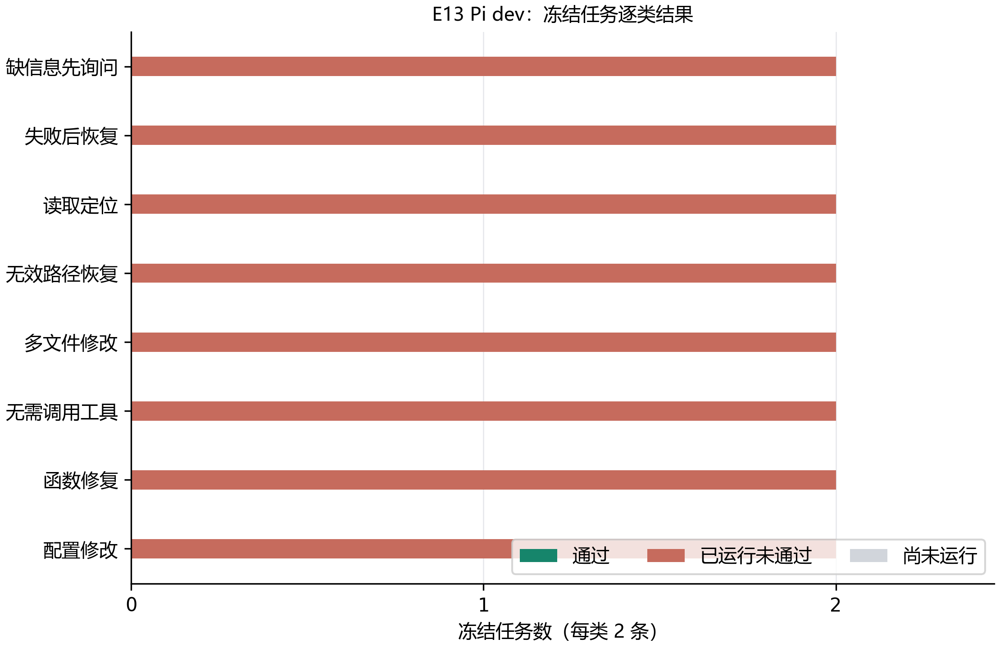

# E13：工具真的能读写和执行，才轮得到模型来做任务

Pi 的 read、edit、write、bash 已经在本机 Docker 容器里跑通。最后一轮核验共发出 20 次请求，其中 11 次正常返回，9 次触发预期的错误或预算限制。这里没有调用模型，所以这 20 次请求是工具链检查，不是 20 道 Agent 任务，也不能换算成模型成功率。

## 四个工具接上以后，实际做成了什么？

这次先写了一个故意算错的加法函数：`sum(2, 3)` 原本返回 -1。用 read 读回文件，再让 edit 把减号换成加号，最后通过 bash 调用容器里的 Node 执行。真实输出是 5，进程退出码为 0；容器里的 Node 版本也实际打印为 v24.14.0。结束前再次读取文件，确认改动确实留在文件里。

| 工具 | 实际操作 | 核对到的结果 |
| --- | --- | --- |
| write | 创建函数文件 | 文件内容和末尾换行都保留 |
| read | 读回文本，再读一张固定 PNG | 文本逐字一致；图片返回 image/png |
| edit | 把 `a - b` 改成 `a + b` | 返回修改位置与 diff，最终文件内容正确 |
| bash | 导入修改后的函数并运行 | 输出 5；退出码 0 |

Pi 0.99.1 的 edit 参数不是凭印象写的。这一版用 `edits` 数组接收替换项，核验时实际传入的是：

```json
{
  "path": "src/sum.mjs",
  "edits": [
    {"oldText": "a - b", "newText": "a + b"}
  ]
}
```

工具名称、说明和参数来自实际安装的 Pi 包。适配代码只替换它提供的文件与命令 operations，文本截断、编辑差异和图片读取仍使用 Pi 的实现。任务文件留在容器里，主机上的 Pi 负责组织调用与处理返回。

## 失败返回有没有保留下来？有，而且不能只看正常例子

模型之后会遇到不存在的文件、写错的替换文本，甚至一直重复调用。接入前先把这些情况实际跑一遍，才能知道模型收到的是什么。

| 条件 | 真实返回或状态 | 这次得到的结论 |
| --- | --- | --- |
| 读取不存在的文件 | ENOENT | 没有被改成空文件或正常返回 |
| edit 的旧文本不匹配 | 提示旧文本必须精确匹配 | 不能把“想改”当成“已改” |
| 文件路径含 `../` 越界 | 文件路径超出任务工作区 | 文件工具拒绝访问工作区外 |
| 文件路径经过指向外部的符号链接 | 符号链接超出任务工作区 | 只检查路径字符串还不够 |
| 第 13 次工具请求 | 任务超过工具调用预算 | 失败请求也占用前 12 次预算 |
| 命令主动以 7 退出 | 返回退出码 7，标记错误 | 非零退出没有被吞掉 |
| sleep 3，命令时限设为 1 秒 | 提示命令超时；约 1.2 秒返回 | 单条命令的时限分支生效 |
| 独立任务总时限设为 2 秒，执行 sleep 5 | 提示任务超过总时限 | 到期后移除该任务容器 |

最后一行专门检查“总时限到期”的分支，用的是另一个诊断容器。正式任务配置仍为 300 秒，单条命令上限 60 秒、最多 12 次工具调用；模型上下文预算保留 8192 token，没有为了更快完成核验而改小正式预算。

## 容器边界实际检查到了什么？

Docker inspect 显示任务容器使用 none 网络、只读根文件系统和非 root 用户，去掉了全部 capabilities；没有宿主目录或数据卷挂载，也没有请求 GPU。实际连接外部地址时返回 ENETUNREACH，往根文件系统写入时返回 EROFS。

read、edit、write 的文件输入限定在任务工作区，适配层同时检查规范化路径和实际父目录。bash 则在这个容器内部运行，可以使用容器提供的 Node 和系统程序。工作区和临时目录可写，任务没有挂载真实项目或凭据。两种约束的范围不同，不能仅凭文件工具拒绝越界，就说 bash 只能看到工作区。

容器按任务独立创建，核验结束只移除本轮创建的容器。最终文件快照、工具参数、逐次返回和镜像 digest 都已保存，可以回看“文件最后变成什么样”，而不只是看调用有没有报错。

## 中间改了两处，原因都来自真实返回

第一轮在 read 之后停止了。文件确实读出来了，但核验代码把预期字符串末尾的换行删掉，导致与 Pi 原样返回的文本不一致。这是比较判据写错了；修正时保留文件原文和工具输出，原失败记录也保留。

后面还发现，Pi 在 Windows 主机生成的编辑补丁和错误提示中，会出现主机侧的虚拟文件位置。虽然文件操作仍发生在容器里，这种返回却会让模型误以为应该使用 Windows 路径。适配层现在把返回正文、补丁和错误中的文件位置统一为容器路径。改动后另开一轮核验，20 次请求再次通过，编辑失败也显示容器里的文件位置。

固定 PNG 只用于确认图片读取接口，大小为一像素，不作为实验截图或效果图。文字和图片两种返回都跑过后，工具链准备才算有了可复查的依据。
## 微调模型接入 Pi 后，能不能独立完成开发任务？

### 这轮评测检查什么？

E13 把已微调的 Qwen3-1.7B 接入 Pi 0.99.1，让模型在真实会话里选择 read、edit、write、bash 工具，并根据工具返回继续处理。每道题使用新的隔离容器和 Agent 会话；最终文件状态、必要的命令输出以及任务要求共同决定是否通过。16 道 dev 任务是从 40 个场景中按类别冻结的子集，每类 2 条。

模型使用 E09-R15 适配器；E09 固定 dev 结果为 411/500。Pi 条件沿用 0.2 温度、推理 seed 17、8,192 token 上下文、每题最多 300 秒和 12 次工具调用。有效成绩仅统计通过提示内容核验的运行。

### 输入检查发现了什么？

Pi 以 `[{"type":"text","text":"…"}]` 形式交付用户消息；历史 API 归一化代码没有提取文本块，直接把数组传给 tokenizer。R01/R02 的归档代码和逐题事件均保留了这一输入形态，因此两轮虽完成进程执行，却没有有效送达任务文本，不能作为模型能力成绩。修复后的 API 只接受受支持的文本块，并在每个任务记录任务提示哈希和模型输入提示哈希；不同冻结任务若渲染成相同输入会立即停止。

### 实际结果如何？

| 运行 | 提示条件 | 任务通过 | 工具调用 | 工具错误返回 | 输出截断 |
| --- | --- | ---: | ---: | ---: | ---: |
| E13-R03 | few_shot | 0/16 | 12 | 6 | 3 |

| 任务类型 | E13-R03 通过 |
| --- | ---: |
| 缺信息先询问 | 0/2 |
| 失败后恢复 | 0/2 |
| 读取定位 | 0/2 |
| 无效路径恢复 | 0/2 |
| 多文件修改 | 0/2 |
| 无需调用工具 | 0/2 |
| 函数修复 | 0/2 |
| 配置修改 | 0/2 |



### 失败例子具体卡在哪里？

E13-R03 的逐任务判据记录到 16 条未通过，代表例子如下：

- `dev-ambiguous-target-tenant-2`（缺信息先询问）：answer_missing_required_information。
- `dev-ambiguous-target-tenant-5`（缺信息先询问）：answer_missing_required_information。
- `dev-await-format-result-1`（失败后恢复）：execution_check_failed。

### 现在能下什么结论？

修正后的有效运行 E13-R03 在冻结 Pi dev 子集上通过 0/16。该分数只代表这16条任务，不能外推到Pi全量或官方基准。

输入完整性审计：`experiments/E13/prompt-delivery-audit.json`。旧运行原始记录保留，但因任务文本接线不完整而排除：E13-R01、E13-R02。

## 证据索引

实际配置、逐条任务、模型请求轨迹和精简结果均按运行号分开保存：

- `.local/runs/E13-R01/config.json`、`.local/runs/E13-R01/result.json`、`.local/runs/E13-R01/progress.json`、`.local/runs/E13-R01/records.jsonl`、`.local/runs/E13-R01/model-api.jsonl`、`.local/runs/E13-R01/model-api.stderr.txt`；公开摘要：`experiments/E13/runs/E13-R01.json`；无效接线，不参与能力比较

- `.local/runs/E13-R02/config.json`、`.local/runs/E13-R02/result.json`、`.local/runs/E13-R02/progress.json`、`.local/runs/E13-R02/records.jsonl`、`.local/runs/E13-R02/model-api.jsonl`、`.local/runs/E13-R02/model-api.stderr.txt`；公开摘要：`experiments/E13/runs/E13-R02.json`；无效接线，不参与能力比较

- `.local/runs/E13-R03/config.json`、`.local/runs/E13-R03/result.json`、`.local/runs/E13-R03/progress.json`、`.local/runs/E13-R03/records.jsonl`、`.local/runs/E13-R03/model-api.jsonl`、`.local/runs/E13-R03/model-api.stderr.txt`；公开摘要：`experiments/E13/runs/E13-R03.json`

输入完整性审计记录：`experiments/E13/prompt-delivery-audit.json`。

抽样配置：`configs/pi-agent-eval.json`；冻结 dev id：`configs/subsets-frozen.json` 的 `pi_dev`；few-shot 来源：`configs/prompt-frozen.json`；E09 模型选择成绩：`experiments/E09/runs/E09-R16.json`。图表数据哈希：`experiments/E13/figures/pi-agent-dev.source.json`。
