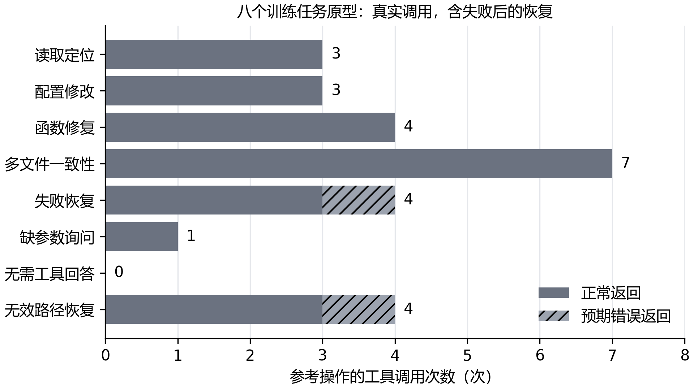
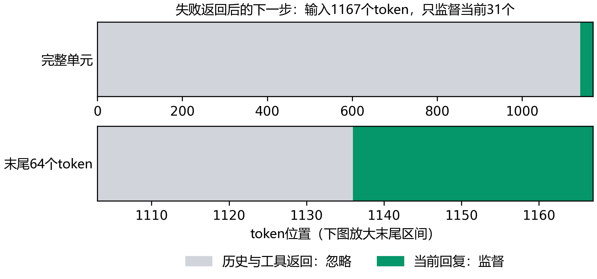
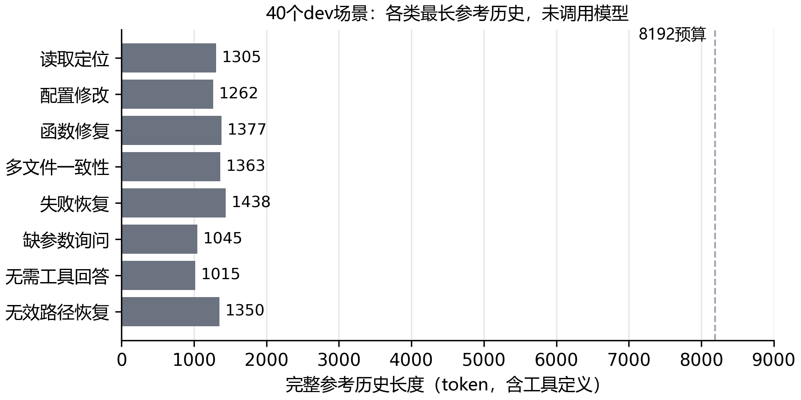
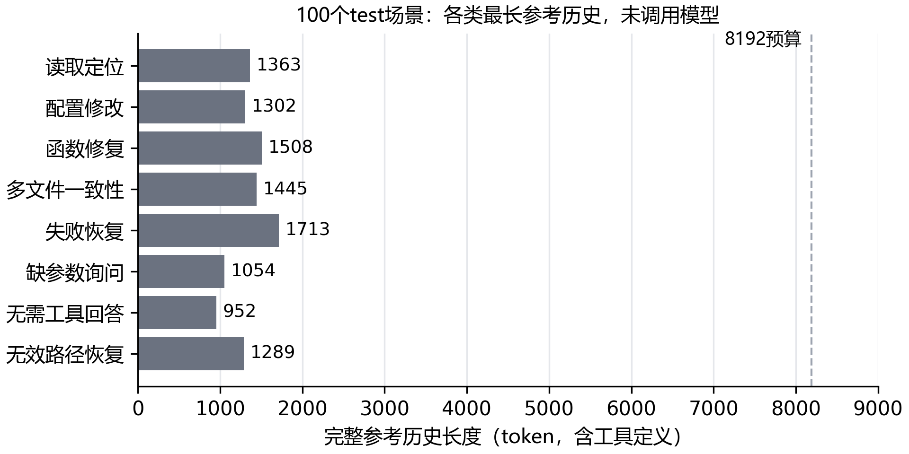
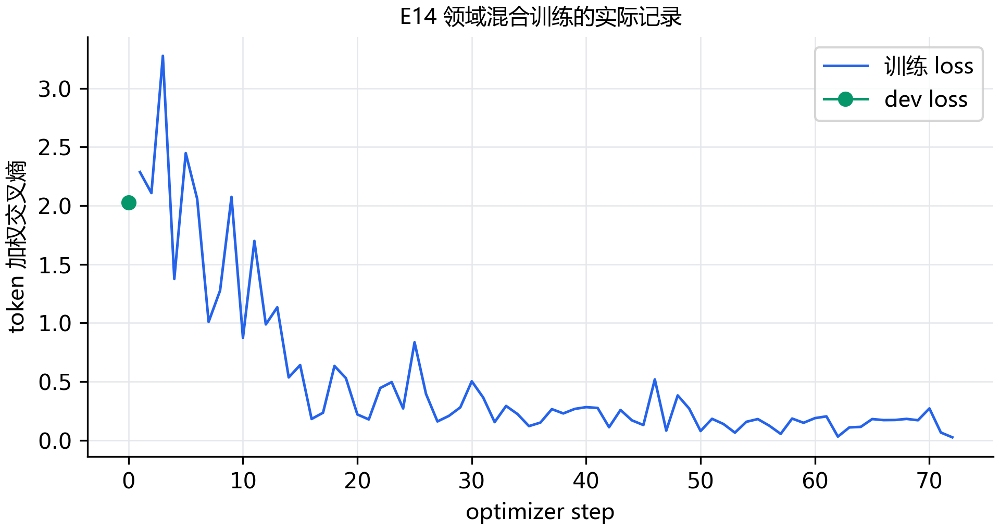

# E14：先把任务判准，再让模型来做

怎样才算任务做成了？这次先把判据跑了一遍。八类训练任务原型的参考操作全部通过；同一批任务的初始错误候选和刻意构造的错误候选，各有 8 个被拒绝。检查依据是最终文件、实际运行结果和必要的回复内容，模型说一句“已完成”不能代替这些结果。

这轮是 E14-R01，从创建任务容器到完成核验用了 41.2 秒，不含写任务和整理文档的时间。参考过程共调用工具 26 次，包含 2 次预期错误；另外有 7 次调用用于构造错误候选。模型调用数为 0，八个原型只属于训练区。下面继续按规模扩展、训练格式、dev和test分别记录后续结果。

## 为什么不直接从“把一个函数改对”开始算成绩？

单独改一行代码，容易忽略真正做任务时的上下文。这次把代码放进可离线运行的小项目：入口可能经过两个模块才找到目标，配置里有容易改错的相邻字段，多文件修改要同时对齐生产端、展示端和 schema。还保留了不应使用的旧文件，检查参考操作有没有沿着当前项目结构找到答案。

每个原型在两个独立容器里运行。第一个容器先检查原始错误状态或错误答案，再执行一个明确错误的操作；第二个容器从原始文件重新开始，运行规则给出的参考步骤。文件初始化和最终判据由核验程序执行，不混入参考轨迹的工具调用次数。

| 任务类别 | 参考调用（次） | 错误返回（次） | 参考结果 | 错误候选 |
| --- | --- | --- | --- | --- |
| 读取定位 | 3 | 0 | 通过 | 拒绝 |
| 配置修改 | 3 | 0 | 通过 | 拒绝 |
| 函数修复 | 4 | 0 | 通过 | 拒绝 |
| 多文件一致性 | 7 | 0 | 通过 | 拒绝 |
| 失败恢复 | 4 | 1 | 通过 | 拒绝 |
| 缺参数询问 | 1 | 0 | 通过 | 拒绝 |
| 无需工具回答 | 0 | 0 | 通过 | 拒绝 |
| 无效路径恢复 | 4 | 1 | 通过 | 拒绝 |



多文件任务实际用了七次工具调用，无需工具的回答则一次也没有调用。两种恢复任务各保留一次失败返回，随后根据项目内容继续处理。这张图说明参考过程实际做了哪些操作，不能据此推断模型会选对工具，也不能把调用次数多当成任务更难的充分证据。

## 只输出“通过”，能不能蒙混过去？不能

函数修复、多文件修改和失败恢复这三个任务，都试过把检查脚本改成直接输出预期的成功文本。命令的退出码变成了 0，输出也对上了，但判据仍然拒绝：检查文件的哈希与初始值不同。这样可以挡住“修改检查，让错误代码看起来通过”的做法。

下面是实际实现中检查受保护文件的核心逻辑。`files` 是结束时的文件快照，`task.files` 保存初始文本，`allowed_changes` 只列本次允许修改的文件。

```javascript
for (const [name, value] of Object.entries(task.files)) {
  if (!task.allowed_changes.includes(name) &&
      byPath.get(name)?.sha256 !== digest(value)) {
    reasons.push('protected_file_changed:' + name);
  }
}
```

配置任务还做了一个更隐蔽的错误：search 的缓存容量按要求改成 120，却顺手把 admin 的容量从 20 改成 21。文件可以解析，但完整 JSON 状态比较仍然拒绝。只检查目标字段变成 120，会漏掉这个额外改动。

## 错误返回有什么用？字符串修复这次就靠它定位

失败恢复任务先运行现有检查，真实返回退出码 1：输入含连续空格时，得到 `a- b`，预期是 `a-b`。读回函数后可以看到，旧写法只替换一次普通空格。参考操作把它改成匹配连续空白的正则，再运行原检查，五个样例全部通过。

```javascript
// 旧写法只替换第一个普通空格
value.trim().replace(' ', '-').toLowerCase();
// 修复后同时处理连续空格、制表符和换行
value.trim().replace(/\s+/g, '-').toLowerCase();
```

这五个样例涵盖连续空格、制表符、换行、普通字符和纯空白。失败的第一次调用仍留在轨迹里，不能为了让过程显得顺利而删掉它。最终判据又独立运行一次原检查，核对退出码和输出。

路径恢复也保留了真实 ENOENT：旧库存文件不存在。参考步骤继续读项目说明和导出清单，找到当前库存，数量 7、12、4 相加得到 23。错误候选则新建了一个同样合计 23 的旧路径文件，即使答案里的数对了，判据仍因新增文件而拒绝。

## 信息没给全时，问清楚比猜一个数更合适

用户只说把上传超时“调大一些”，没有给目标秒数。参考操作读到当前为 30 秒后询问目标值，保留原配置。错误候选一边问目标值，一边已经改成了 60 秒；回复看起来谨慎，文件却已被擅自修改，所以仍被拒绝。

无需工具的任务则直接解释“每秒最多允许八次请求”。错误候选答案正确，却先去读了无关配置；因为任务明确要求只根据已给文字回答，这次额外调用也被拒绝。这里考察的是有没有遵守具体任务约束，不是规定所有解释性问题都禁止使用工具。

## 这轮确认了什么，还要补什么？

现在确认了八个原型能真实执行，判据能够发现这批明确构造的错误，文件快照和失败返回也能保留下来。每个任务的参考调用都在 12 次预算内；容器无网络、没有宿主目录挂载，也没有 GPU 请求。本轮创建的 16 个容器结束后都已移除。

原型的覆盖还有限。代码判据使用任务自带的固定样例，不能保证发现所有绕过方式；询问与解释类回复只做必要词语检查，真实模型接入后还要逐条复查语义。后续扩展训练任务结构，并为 dev 和 test 单独建立模板族、仓库族，避免只换几个变量名就把同一道题算成未见过的任务。

复习时可以先看两个问题。为什么命令输出正确还可能失败？因为检查文件或不该动的配置也可能被改过，输出只是成功条件的一部分。为什么参考操作 8/8 不能写成 Agent 成功率 100%？因为步骤由规则预先给定，还没有让模型自己选择工具、读取错误并决定下一步。

## 工具轨迹怎么变成训练样本？保留历史，每次只学当前回复

E14-R02 把这八条参考过程转换成了 34 个回复单元，共 1,258 个监督 token。一次工具调用是一个 assistant 回复，轨迹结束时的总结或询问又是一个回复；所以“八条轨迹”并不等于“八个训练单元”。这些答案和步骤仍来自已执行的任务规则，没有混入教师生成。

转换时逐个保留调用 id、工具名、参数和真实文本返回，两次错误也没有丢掉。官方 Qwen3 模板在文本中呈现工具名和参数，不把本轮 Pi 的调用 id 当作模型要生成的内容；数据里仍保存 id，便于核对请求与返回是否对应。34 个单元逐个检查了模板文本、token、推理前缀和监督位置，带监督标记的模板与官方模板渲染一致。

| 任务类别 | 回复单元（个） | 最长输入（token） | 监督量（token） |
| --- | --- | --- | --- |
| 读取定位 | 4 | 1114 | 120 |
| 配置修改 | 4 | 1180 | 158 |
| 函数修复 | 5 | 1358 | 217 |
| 多文件一致性 | 8 | 1432 | 356 |
| 失败恢复 | 5 | 1347 | 190 |
| 缺参数询问 | 2 | 969 | 52 |
| 无需工具回答 | 1 | 924 | 21 |
| 无效路径恢复 | 5 | 1143 | 144 |

这里的输入长度包含工具定义和完整历史。最长单元为 1432 token，34 个单元都在 2048 以内，没有截断。这只是八个短项目的实测长度，后续扩展任务仍要逐条检查，不能据此认定所有领域轨迹都适合 2048。

## 前面报错了，会不会连报错文本也一起训练？这次没有

字符串修复中，第一次命令失败后，下一步应读回函数。这个真实单元有 1167 个输入 token，监督位置只有当前回复的 31 个 token；此前的调用、错误返回和问题都被遮掉，只作为上下文。监督量包含官方模板在 assistant 分支中的标记和结束 token，不能把它全当成普通答案文字的长度。



错误返回留在输入里，模型有机会根据它决定下一步；loss 的目标仍是当前回复。这次全部 34 个单元的历史监督量都为零，图中选的是明确经历过命令失败的单元。检查通过说明数据表示与遮罩对应，还不能说明模型训练后学会了恢复。

该单元的目标里实际包含下面这次调用：

```json
{"name": "read", "arguments": {"path": "src/slug.mjs"}}
```

这轮先得到可追溯的原型训练格式，接着逐条扩展到正式1,000条，进展放在后面的批量执行小节。本轮只调用tokenizer，未初始化CUDA，也未进行模型前向或更新参数。

## 再加八个模板，解题过程变在哪里？

E14-R03 新增了八个训练模板族。参考操作8/8通过，初始错误和八个明确构造的错误方案全部被拒绝。新增参考共调用工具29次，包含2次真实错误返回；错误方案另用了9次工具。容器执行与记录耗时43.5秒，这个时间不含任务编写与文档整理。

| 类别 | 新模板需要处理什么 | 参考调用（次） |
| --- | --- | --- |
| 读取定位 | 按配置从注册表选择存储实现 | 3 |
| 配置修改 | 只加 staging 覆盖，保留生产默认值 | 4 |
| 函数修复 | 去重后按最后出现的位置排序 | 4 |
| 多文件一致性 | 毫秒改秒，保持真实延时 | 7 |
| 失败恢复 | 模块移动后的相对导入修复 | 5 |
| 缺参数询问 | 提醒时间没有给时区，先询问 | 1 |
| 无需工具回答 | 根据已知速率计算窗口预算 | 0 |
| 无效路径恢复 | 按商品状态联表统计库存 | 5 |

这次改变了数据结构或错误原因。原来的配置任务直接修改一个值，新任务要区分默认值和环境覆盖；原来迁移指标字段，新任务还要做单位换算；路径恢复从单文件求和变成两份数据联表，并排除停售和未知商品。

## 字段改好了，为什么仍然判失败？实际延时没有保持

时间单位迁移的错误方案把refreshMs改成refreshSeconds，却保留2500这个数，读取函数也直接返回它。最终输出看似仍是2500毫秒，但新配置的含义已变成2500秒，而且其他秒数无法正确换算。判据同时核对配置值与读取函数：2500毫秒应写成2.5秒，0.125秒应读成125毫秒。错误方案的配置检查与执行检查都失败，规则参考保留了实际延时。

参考修复中的这行是真实执行过的代码：

```javascript
export const delay = config => config.refreshSeconds * 1000;
```

## 倒序去重能保留最后对象，为什么也失败？顺序和输入都要检查

新去重任务要求a、b、a返回b、a。错误方案先反转输入数组再去重，虽然能留下最后一个a，却改变了输入，也没有遵守输出顺序。现有检查比较独立的筛选结果，并在调用前后核对输入序列；本轮执行了42组样例，其中40组由固定seed=73生成。42组函数样例仍属于一个任务，不能算成42条领域轨迹。

移动模块的恢复任务也保留了第一次命令的真实导入错误。参考步骤根据迁移说明修正相对导入，再跑原检查；错误方案补回旧路径文件，被新增文件和执行检查拒绝。故障原因与上一批的空白正则错误不同。

这两批共16个训练模板族，各有一条已验证参考过程。它们都属于train；批量扩展与独立任务集见后续小节，模型迁移仍单独评测。参考步骤由规则给定，没有模型自主选择工具；这16条不能写成模型成功率。判据仍有有限样例和询问语义只查必要词的局限，后续模型结果要保留逐条复查。

## 新增过程能完整表示吗？37个单元已逐条核验

E14-R04 将新增八条过程转换为37个回复单元，共1,305个监督token，最长输入1497token。29次调用的参数、实际返回和最终回复逐条与原记录比对，解码监督目标也对应当前动作；没有截断，未初始化CUDA。

导入失败后的下一步是读迁移说明，这个单元输入1280token，只监督当前30个；旧路径错误后的下一步是读项目说明，输入997token，只监督当前28个。两个错误返回都留在上下文中，历史监督量为零。这里验证了表示和遮罩，没有进行参数训练。

两批现有16条规则参考合计71个回复单元、2,563个监督token。它们各自属于原模板族，不能把展开单元当成新增独立任务，也不能由最长1,497token推断正式扩展数据都适合2048；后续数据继续逐条检查长度。

## 有2,000个场景，是否已经有2,000条有效轨迹？还没有，先逐条执行

E14-R07 冻结了2,000个训练场景，16个模板族各125个，八类各250个。前1,000个场景作为本轮规则参考目标，八类各125个。清单改变实际配置、边界样例、选择的模块、时间和库存关系；这里只统计待执行场景，不把生成的参考步骤直接算成成功轨迹。

前两轮都被精确去重拦住。第一轮实际只有1,979个不同场景，时间单位任务出现21个重复；第二轮调整延时取值后，提醒任务仍有7个重复，只有1,993个不同场景。随机取值的范围有限，id不同也会抽到同一组实际内容。两轮没有用于参考批量执行。随后为延时和日期使用确定的取值序列，保留其他场景变化，新的2,000份完整问题与文件内容没有精确重复。

这批数据仍共享16个模板族，属于训练区的场景增广。精确去重不能消除这种结构相似性，模型接触过的处理方式也不会因此变成未见任务。dev/test另建模板和仓库族，分别记录冻结与执行结果；教师生成只使用训练区场景。

E14-R08 已实际处理1000/1000个场景，其中1000条参考通过，0条失败；已记录3436次工具调用和250次错误返回。整轮参考执行已结束，失败保留在原目标分母。每条过程使用独立容器，执行结束核对最终文件，再移除本轮容器；本阶段没有调用模型。

完整参考过程随后在 E14-R11 转成训练格式：1,000个场景展开为4,436个当前回复单元，共169,321个监督token，最长1,547个token。每个单元都核对了实际工具返回、官方模板和监督位置，没有截断。数据仍属于上述16个训练模板族；格式核验通过后，领域训练与独立任务迁移评测继续单独进行。

## dev能检查迁移吗？40个场景已冻结，按八个新任务族观察

E14-R09 实际执行了40个dev场景，八类各5个。规则参考40/40通过，40个初始错误和40个明确构造的错误候选都被拒绝。参考过程调用工具155次，保留10次预期错误返回；错误候选另用了35次工具。每个场景各用一个检查错误候选的容器和一个执行参考解的容器，本轮80个容器均已移除。

| 类别 | dev具体检查什么 | 场景（个） | 每条参考调用（次） |
| --- | --- | --- | --- |
| 读取定位 | 按两个功能开关和路由表定位实际处理函数 | 5 | 5 |
| 配置修改 | 只更新指定租户的 email 订阅行 | 5 | 3 |
| 函数修复 | 解析逗号、引号、转义引号及尾部空列 | 5 | 4 |
| 多文件一致性 | 同步函数导出、转发入口和调用方名称 | 5 | 7 |
| 失败恢复 | 等待异步格式化，保留异常向上传播 | 5 | 6 |
| 缺参数询问 | 两个租户都匹配时询问目标，不写配置 | 5 | 2 |
| 无需工具回答 | 按题中定义计算20个测量值的p95 | 5 | 0 |
| 无效路径恢复 | 从旧路径错误找到截止日前最近成功报告 | 5 | 4 |

训练区有16个模板族，这轮dev另用8个模板族和仓库族，两边完整问题与初始文件的精确重复数为零。差别还需要看实际任务：训练配置题修改嵌套值或环境覆盖，dev题要在数组中同时匹配租户和通道；训练函数题处理空白或去重，dev题要按引号状态解析CSV。任务结构变了，模型是否能迁移到这些结构，要等它自己运行后判断。

40个场景也不是40种题型。每个新模板有5个不同场景，族内仍有相似性，最终同时列任务成绩和任务族成绩。dev可用于选择方案；最终100个test使用另外的任务族，不从dev换几个数值获得。

## 去掉引号再按逗号分割，为什么会错？引号内的逗号也是字段内容

CSV任务中的一个实际样例是下面这行，前两列分别应是a,b和c，而不是a、b、c三个字段：

```text
"a,b",c
```

错误候选去掉所有引号后再split，遇到这个样例就失去字段边界；它在容器中执行后，被原检查判为失败。参考解逐字符维护引号状态，只有引号外的逗号才结束当前字段，还处理转义双引号和最后一个空字段。这次只要求单行CSV，没有把跨行字段写成已覆盖能力。

## 正常结果看着对，恢复过程就对了吗？还要保留异常

异步格式化任务最初把Promise拼进字符串，先运行原命令确实报错。错误候选绕过格式化函数后，普通数字看起来正常，但负值本应抛出的异常被吞掉，仍被拒绝。参考解等待异步结果，正常、零值和异常传播都通过了原检查。成功判据检查行为，不能只看一句“完成了”。

这批参考解是任务规则给出的步骤，没有模型自主调用，尚无Agent成功率。询问类目前只查必要词和禁止修改，语义判据仍较粗；模型接入后需要结合实际回复逐条复查。最终文件、工具返回和错误候选都保留，用来定位以后真正的模型失败。

近似重复也做了一轮检查：问题和初始文件统一小写、归一数字后，按字符5-gram的Jaccard相似度比较train与dev的80,000对组合，阈值固定0.8。归一后的精确重复为零，达到阈值的组合也为零，最高相似度为0.2159。这种筛查还不能排除语义上的相似，也查不到预训练阶段见过哪些样本，所以仍要结合上面的任务结构区别理解。

## 工具返回都带上，会超过上下文吗？这批参考没有超过8192

E14-R10 用固定系统提示、真实工具定义及原样工具返回，检查195个回复位置。最长推理前缀1,431token，带上该次参考回复后最长1,438token；超8192的数量为零。只运行tokenizer，没有加载模型、初始化CUDA或生成训练标签。



图里测的是参考解走过的历史。模型可能多读文件、反复失败或生成更长回复，所以这不能保证它的实际轨迹也在预算内；正式运行仍逐条记录长度、截断和超时，保留在40个任务的分母里。

## 参考解为什么也没通过？生成的检查文件先出了语法错误

E14-R13 完成了前28个场景，停止在test-global-regex-state-1。失败时的文件、调用和返回都保留，修复后另开运行。

编号样例含末尾换行，生成器把它直接拼进单引号字符串，写出的JavaScript无法解析。容器中的实际文件和Node报错对应得上；这次不能把问题归到编号函数。后续用JSON.stringify序列化整组样例，让换行以转义形式进入文件。题目规则和检查样例没有删减，完整100题重新核验。

```javascript
// 样例先当数据保存，再序列化成合法的源码字面量
const cases = [["AB-123\n", false]];
const literal = JSON.stringify(cases);
```

## 最终100题能用了么？题目和参考已核验，模型还没跑

E14-R14 实际检查了100个场景：参考100/100通过，100个初始错误和100个明确错误候选都被拒绝。共397次参考工具调用，保留21次预期错误，以及7个场景中的真实空查询；错误候选另调用工具88次。本轮200个独立容器均已移除，参考与错误候选没有共用状态。

配额先为八类各留10题，再把余下20题分给更需要追踪状态、维护多个文件或恢复错误的类别。没有参考模型成绩来删题或调分母。

| 类别 | 场景（个） | 两个新任务族检查什么 | 参考调用（次） |
| --- | --- | --- | --- |
| 读取定位 | 12 | 依赖图间接影响、有序拦截链 | 2—5 |
| 配置修改 | 12 | 规则插入位置、共享配额解绑 | 4—4 |
| 函数修复 | 14 | 拓扑排序与环检测、递归合并删除 | 4—4 |
| 多文件一致性 | 14 | 校验和编解码、权限集合往返 | 7—7 |
| 失败恢复 | 14 | 跨调用正则状态、嵌套默认对象共享 | 5—5 |
| 缺参数询问 | 10 | 页码基数、删除或归档约定 | 2—2 |
| 无需工具回答 | 10 | 加权均值、按公式约分F1 | 0—0 |
| 无效路径恢复 | 14 | 空查询别名恢复、分片最新事件归并 | 4—5 |

这100个场景分属16个模板族，仍不是100种完全不同的问题。测试题要求的算法和状态处理与train、dev有所区别：函数题要考虑图的依赖与环、对象递归及输入引用，多文件题要让读写双方遵守相同契约。它们属于自编的小仓库任务集，正式结果按任务和任务族分别展示，不代替标准榜单。

清单已经冻结。此后用dev选提示词和checkpoint，教师只处理train；最终test等方案确定后统一运行，每个任务重复三次，失败、超时和截断仍留在100题的分母里。

## 答案算对了，空查询题就算成功吗？还要真的完成恢复过程

其中一个场景第一次查询旧key，工具正常退出，却返回空数组。参考过程读项目说明和别名，再用当前key查到数据，只汇总done记录。错误候选直接给出完全正确的最终JSON，却没有经历空查询，仍被判据拒绝。这道题明确要求先查旧key，再恢复；检查的是这个过程，而不只是最终数字。

```javascript
// 实际判据中的空查询检查
block.type === 'text' && block.text.trim() === '[]'
```

共享默认配置的错误候选也值得看：只复制顶层对象，cache和tags仍指向原对象。第一次返回值改了tags，下一次就拿不到原始默认值。参考解复制嵌套数据，保留显式false、retries=0和未指定的默认字段，原检查才全部通过。

```javascript
// 只复制顶层，嵌套对象仍会共享
const result = {...defaults};
// 本轮参考从独立默认对象开始，再应用覆盖项
const result = structuredClone(defaults);
```

这些明确错误候选只能说明判据能拦住本轮检查过的错误。询问类仍需复查模型回复的语义，代码题的固定样例也不能证明覆盖所有实现。正式模型轨迹要继续检查实际调用、返回和文件状态。

## 题目变复杂，会不会先撞上下文？本轮参考最长1,713token

E14-R15 用固定系统提示、实际工具定义、原样返回和非思考模板检查497个回复位置。最长生成前缀1,706token，带上当前参考回复最长1,713token，超过8192的数量为零。本轮只运行tokenizer，没有初始化CUDA或生成训练标签。



这是参考解的长度。模型可能反复读取或改错后重试，正式评测仍记录实际上下文、工具次数和超时，不能用参考长度代替模型轨迹长度。

重复检查也已完成：test与2,000条train请求比较200,000对，与40个dev比较4,000对。场景、模板族和仓库族交叉为零；数字归一后的精确重复及达到0.8阈值的字符5-gram组合均为零，最高相似度分别为0.2392和0.2615。这能复查具体筛查规则，仍不能排除语义相似或预训练污染。

## 领域混合微调与迁移评测

### 训练样本如何组成？

训练集由512条公开工具轨迹和512条Pi规则参考轨迹组成。公开样本按来源与调用类别分层抽取；Pi样本从16个训练模板族各取32条。样本清单在查看模型成绩前冻结，固定100条公开dev继续用于loss选择和工具决策评测。

冻结记录确认了512条公开轨迹、512条Pi轨迹，Pi覆盖16个训练模板族；训练条数按独立轨迹计算。Pi dev和test采用单独模板族，本轮训练不会读取test。

| 来源 | 类别 | 轨迹数 |
| --- | --- | ---: |
| glaive | multi_turn | 97 |
| glaive | no_call | 79 |
| glaive | single_call | 245 |
| hermes | multi_turn | 37 |
| hermes | no_call | 1 |
| hermes | parallel | 14 |
| hermes | single_call | 39 |
| minillm_pi_rules | config_change | 64 |
| minillm_pi_rules | failure_recovery | 64 |
| minillm_pi_rules | function_fix | 64 |
| minillm_pi_rules | invalid_path_recovery | 64 |
| minillm_pi_rules | missing_information | 64 |
| minillm_pi_rules | multi_file | 64 |
| minillm_pi_rules | no_tool | 64 |
| minillm_pi_rules | read_locate | 64 |

Pi每类都是64条：该类两个独立训练模板族各抽32条；公开部分按原1k样本的来源和类别占比分层。

### 训练进展与验证曲线

训练已结束：共更新472步，最低冻结dev loss为0.189352。这项loss用于挑选checkpoint，不等同于Agent任务成功率。

首次冻结检查因来源文件哈希配置不匹配而停止；核对本机文件后修正配置，再按相同抽样规则完成冻结。错误发生在训练集写入前，失败记录保留。



### 固定公开集和 Pi 任务的实际成绩

固定公开dev通过64/100条；逐轮结果保留了100条完整分母。
Pi dev接入排错（E14-R21）：已运行2/16个任务后中止。会话工作目录与容器路径映射不一致，工具拒绝访问工作区外路径；本轮不计为模型成绩，冻结分母仍为16。
Pi dev接入排错（E14-R23）：已运行1/16个任务后中止。Pi 将相对路径规范化为`F:/workspace/README.md`，wrapper未映射该Windows容器根，读取失败后重复请求并耗尽工具预算；本轮不计为模型成绩，冻结分母仍为16。
Pi dev记录0/16个观察通过；8/16条超时任务在判分前沙箱已被清理，整轮不作为可比模型成绩，原定分母仍为16。
原始调用记录还显示模型反复读取`F:/workspace/README.md`并耗尽12次工具预算；0/16是本轮原始观测值，不作为有效迁移成绩。
Pi dev：0/16个任务通过；超时、截断或工具错误都留在预定分母中。
E14-R26耗时4606秒；14/16个任务超时，2个未超时任务仍未通过。记录412次工具请求，其中220次因12次调用上限被沙箱拒绝。
Pi test：0/40个任务通过；超时、截断或工具错误都留在预定分母中。
E14-R27耗时11324秒；37/40个任务超时，3个未超时任务仍未通过。记录953次工具请求，其中490次因12次调用上限被沙箱拒绝。
E14-R27的40条任务结果与汇总已写入后，运行器在最终进度收尾时报`ReferenceError: tasks is not defined`并退出1；该异常不改变40/40已评、0/40通过的结果。收尾字段现改用冻结配置中的任务数并完成语法核验，未重跑模型。

公开dev的轨迹通过数、Pi任务完成数和token loss回答的是不同问题，不能互相替代。规则参考本身不是Agent成绩；具体错误要回到工具调用、返回和最终文件状态判断。

### Pi Agent 运行记录

- E14-R21：接线无效，中止于2/16；不作为模型成绩。记录：`experiments/E14/runs/E14-R21.json`。
- E14-R23：接线无效，中止于1/16；不作为模型成绩。记录：`experiments/E14/runs/E14-R23.json`。
- E14-R25：dev观察通过0/16；8条超时任务判分时容器已被清理，整轮不作为可比模型成绩；记录：`experiments/E14/runs/E14-R25.json`。
- E14-R26：dev 0/16，14/16个任务超时；记录：`experiments/E14/runs/E14-R26.json`。
- E14-R27：test 0/40，37/40个任务超时；记录：`experiments/E14/runs/E14-R27.json`。

Pi 路径映射核验（E14-R24）：Pi 会话和 SessionManager 均使用`/workspace`；工具返回的`F:/workspace/pi-path-smoke.txt`经隔离write/read往返通过，任务容器已移除。未启动模型服务或生成，不属于Agent成绩。记录：`experiments/E14/runs/E14-R24.json`。
