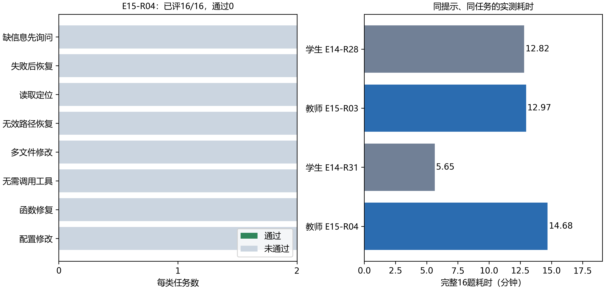

# E15：4B 教师能否更可靠地完成工具任务

本机Qwen3-4B基础模型以NF4量化接入Pi，与Qwen3-1.7B领域适配器使用同一冻结dev16、同一工具和解码预算。每个教师条件绑定使用相同提示的学生运行。任务成绩由实际文件状态、检查结果和最终回答决定。

## 同条件对照

| 提示条件 | 学生 | 学生成绩 | 教师 | 教师成绩 | 教师耗时 |
| --- | --- | ---: | --- | ---: | ---: |
| 原few-shot提示 | E14-R28 | 0/16 | E15-R03 | 0/16 | 778秒 |
| 简短工具提示 | E14-R31 | 0/16 | E15-R04 | 0/16 | 881秒 |

已完成的教师条件均为0/16，与各自学生参照相比增加0个百分点；这批任务尚未观察到教师更可靠。教师回复不能直接当作优质标签，训练场景仍需逐条执行并筛选。

## 预算与错误记录

输入上限8192 token，生成上限1024 token；温度0.2、推理seed17，关闭thinking。每题最多12次工具调用、300秒。预算耗尽立即结束并记失败，超时和截断也保留。

| 教师运行 | API请求 | 任务超时 | 预算耗尽 | 截断回复 | 调用解析失败 |
| --- | ---: | ---: | ---: | ---: | ---: |
| E15-R03 | 96 | 0 | 2 | 0 | 2 |
| E15-R04 | 132 | 0 | 5 | 0 | 2 |

调用解析失败统计的是回复中出现工具调用标记、但没有任何调用成功解析的请求数。



## 错误发生在哪一步

原提示教师在缺信息任务中没有先读取已有配置，就要求用户补充文件里已有的信息；修复时修改受保护的检查文件；路径定位时猜测不存在的文件。部分工具参数的JSON字符串引号没有正确转义，导致调用无法解析。这分别属于任务策略、文件边界和调用格式问题。

实际任务 `dev-await-format-result-1` 未通过的判据为：protected_file_changed:checks.mjs；execution_check_failed。判据检查修复后的文件与测试，模型解释不能代替修复。

```python
accepted = task_passed and schema_valid and arguments_valid
accepted = accepted and not (timed_out or truncated)
```

## 阶段结论

已完成的教师条件均为0/16，与各自学生参照相比增加0个百分点；这批任务尚未观察到教师更可靠。教师回复不能直接当作优质标签，训练场景仍需逐条执行并筛选。

教师使用本地固定revision和模型自带的Qwen3模板，没有经过本项目的LoRA训练。学生、教师模板一致。旧E15-R02的文本块接线无效，原始记录保留且不参与能力比较；有效条件逐题核对任务提示与模型输入哈希。

## 证据索引

| 内容 | 对应记录 |
| --- | --- |
| E15-R03逐题执行与本机生成 | `.local/runs/E15-R03/records.jsonl`；`model-api.jsonl`；`tasks.json`；`config.json`；`result.json` |
| E15-R04逐题执行与本机生成 | `.local/runs/E15-R04/records.jsonl`；`model-api.jsonl`；`tasks.json`；`config.json`；`result.json` |
| 教师来源和条件 | `.local/models/Qwen3-4B/download-manifest.json`；`configs/pi-agent-e15-teacher-dev.json`；`configs/pi-agent-e15-teacher-focused-dev.json` |
| 任务、提示和输入审计 | `configs/subsets-frozen.json`；`configs/prompt-frozen.json`；`configs/pi-focused-prompt.json`；`experiments/E13/prompt-delivery-audit.json` |
| 图表来源 | `experiments/E15/figures/E15-1.source.json` |
