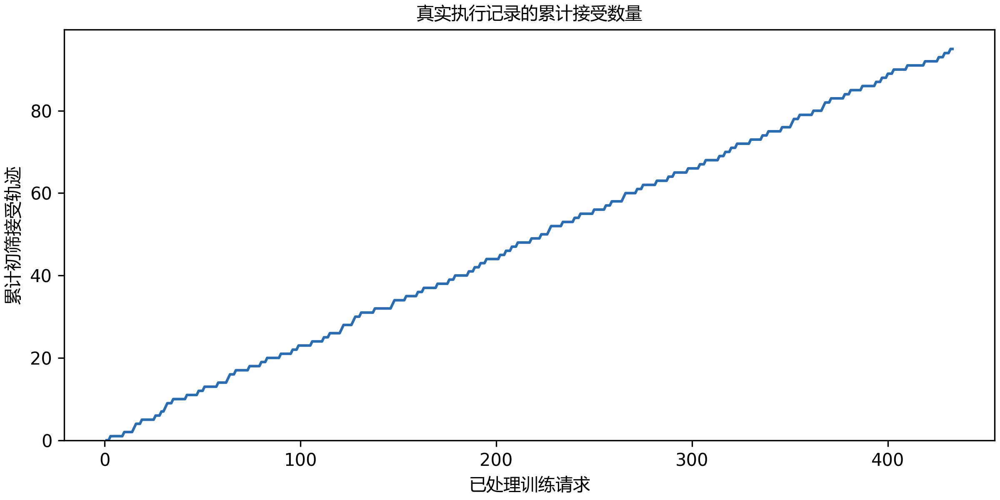

# E16：教师轨迹的执行与筛选

教师处理冻结train请求。首批512条覆盖八类、16个训练模板族；有效量不足256条时，每批扩展128条，最多1024条。模型输入只有任务提示、工具定义和实际工具返回，不包含参考解。

实际已处理433条，执行与格式初筛接受95条。所有拒绝、截断、超时和预算耗尽均保留；初筛轨迹还要经过完整历史的token编码与监督边界检查，才能计为可训练样本。

## 每条轨迹检查什么

每题在新的无网络容器中执行。最终状态通过、工具名和参数schema正确、调用与返回一一对应且没有截断或超时的轨迹，才进入完整编码。发生错误后成功恢复的过程可以保留；JSON正确而任务失败仍被拒绝。

```python
eligible = task_passed and valid_schema and matched_results
eligible = eligible and not (timeout or truncated or budget_exhausted)
```

| 拒绝原因 | 涉及轨迹数 |
| --- | ---: |
| malformed_tool_call | 23 |
| task_failed | 338 |
| tool_budget_exhausted | 58 |
| truncated_or_cancelled | 23 |
| unmatched_tool_result | 1 |



## Pi 消息怎样变成训练单元

Pi 的原生 system 消息可以只有空 content，实际提示保存在结构化 sections 中。转换时使用同版本 Pi 渲染器恢复完整系统提示，包括工作目录；不能把空 content 当成空提示，也不能把 system 角色当作用户消息。

对已落盘的428条请求快照检查，初筛接受的93条均完整编码成功，展开为241个当前回复训练单元，共17959个监督token；最长输入2940 tokens。这是运行中快照，尚未达到256条目标。

241个推理前缀的token哈希与实际API记录逐一相同，规范化消息哈希也相同；历史消息与工具返回不参与当前回复loss。检查没有初始化CUDA，不占用教师推理GPU。

```python
history = messages[:target_message_index]
assert sha256(render_tokens(history)) == request["prompt_sha256"]
labels[:target_start] = -100
```

## 阶段结论

请求仍在顺序执行；当前初筛95/433。这是训练请求的接受率，不能作为dev或test成功率。

## 证据索引

| 内容 | 对应记录 |
| --- | --- |
| 冻结请求与教师条件 | `configs/teacher-requests-frozen.json`；`.local/runs/E16-R01/config.json` |
| 逐题执行与本机生成 | `.local/runs/E16-R01/records.jsonl`；`model-api.jsonl`；`tasks.json` |
| 编码快照核对 | `experiments/E16/encoding-inspection.json`；`.local/checks/E16-R01-encoding/records-428-snapshot.jsonl`；`.local/checks/E16-R01-encoding/records-428-snapshot.inspection.json` |
