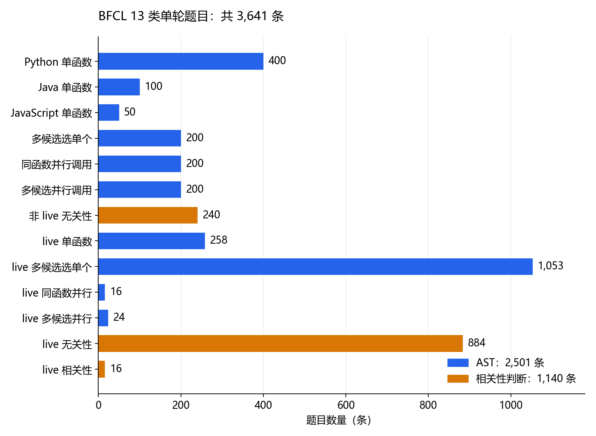

# E22：BFCL 怎么判分？先用29个接口样例弄清规则

这一轮没有让模型答题。E09 还在训练，我先把后续 BFCL 评测要用的题目和检查器固定下来，免得模型跑完以后，才发现题目数量或输出格式没有对齐。

E22-R03 实际核对了13类、3,641条题目，id没有重复。需要参考答案的10类共有2,501条，题目和答案的数量、id及顺序全部对应；另外3类共1,140条，按是否产生有效调用判断相关性，不需要单独的参数答案文件。29个手写样例已经经过官方handler和检查器，过程中没有加载模型，也没有网络连接。

## 这次究竟准备评多少题？3,641条，每一类都保留

使用的是已锁定的bfcl-eval 2025.12.17，安装包的数据前缀是BFCL_v4。类别直接读取这个版本的single_turn定义，没有用当前网页上的题量代替本地清单。文件名虽然以.json结尾，内容实际是一行一个JSON对象，读取时按行解析。

| 类别 | 题目数 | 判分方式 |
| --- | --- | --- |
| Python 单函数 | 400 | 函数与参数匹配 |
| Java 单函数 | 100 | 函数与参数匹配 |
| JavaScript 单函数 | 50 | 函数与参数匹配 |
| 多候选选单个 | 200 | 函数与参数匹配 |
| 同函数并行调用 | 200 | 函数与参数匹配 |
| 多候选并行调用 | 200 | 函数与参数匹配 |
| 非 live 无关性 | 240 | 有无有效调用 |
| live 单函数 | 258 | 函数与参数匹配 |
| live 多候选选单个 | 1,053 | 函数与参数匹配 |
| live 同函数并行 | 16 | 函数与参数匹配 |
| live 多候选并行 | 24 | 函数与参数匹配 |
| live 无关性 | 884 | 有无有效调用 |
| live 相关性 | 16 | 有无有效调用 |



live多候选类别有1,053条，live并行两类分别只有16和24条，数量差别很大。正式报告要逐类给出正确数和总数，不能只看一个混合百分比，也不能拿小类别的一两条变化说明能力稳定提升。

这里的multiple容易和“多轮对话”混淆。它给模型多个候选函数，让模型选择合适的单个函数；parallel让模型输出多个调用，parallel_multiple同时包含候选选择和多个调用。本项目的这份清单仍是单轮工具评测，真正执行任务和反复读写文件的表现留给Pi任务检查。

## 明明不做音频，为什么还缺soundfile？导入链把它带进来了

R01刚开始就报ModuleNotFoundError，尚未进入题目冻结。沿着堆栈往回看，官方model_config会导入Qwen API handler，接着导入qwen_agent；其中的工具模块直接import soundfile。这和本次是否真的调用音频功能没有关系。

当时uv pip check显示128个已安装包兼容。它检查的是包声明的依赖关系，不能保证每条实际导入路径都能运行。实际缺失的soundfile没有出现在已安装qwen-agent 0.0.34的Requires-Dist列表中，因此只看依赖检查会漏掉这个问题。

补装soundfile 0.13.1后，独立环境变为129个包，依赖检查仍通过，官方handler和检查器也成功导入。训练环境没有改动。R01的原始堆栈、补装日志以及更新前后的版本锁都保留了。

R02随后停在手写的Java样例。这次是样例定义写错了：我把参数类型写成int，而BFCL这一版的Java转换表使用integer。Java语言里的类型拼写和基准schema的拼写并不总是一样。修正样例后另开R03，原失败没有覆盖；逐条接口记录也改为每完成一个样例就保存，避免后面的错误让前面的观察丢失。

## 数值都是2和3，为什么Java和JavaScript仍会拒绝？接口表示不同

同样的加法调用，Python样例把参数写成JSON整数可以通过；Java和JavaScript样例则得到type_error。它们的检查器先要求字符串，再把字符串当作对应语言的代码字面量转换。

```json
{"name":"math.add","arguments":{"a":2,"b":3}}
```

上面的写法在这轮Python样例中通过，但在Java和JavaScript样例中被拒绝。把数值以代码字面量字符串传入，下面两个样例才通过：

```json
{"name":"math.add","arguments":{"a":"2","b":"3"}}
```

这次只核对整数样例，没有据此声称数组、浮点后缀或所有语言类型都已经兼容。正式评测仍把模型的原始响应直接送入官方QwenFCHandler，不在事后替模型修正类型或参数值。若以后需要改变格式转换，必须在开发阶段先固定规则、另开运行，并让所有比较模型使用同一规则。

## 调用顺序交换，会被误判吗？这次并行样例仍然通过

手写的并行样例包含两次math.add调用，参数分别为(2,3)和(5,6)。模型候选把顺序交换后，官方检查器仍判通过；少掉其中一个调用则以wrong_count拒绝。多候选并行样例也允许交换两个合法调用的顺序。

普通Python样例中，错误数值、错误参数类型、缺少必填参数、增加多余参数、错误函数名和把bool当作integer，全部被拒绝。字符串比较则更宽松：参考值New York与候选new-york在本轮通过了归一化比较。这与前面公开数据离线评测的严格参数比较不是同一个判分规则，两个成绩需要各自说明口径。

| 手写样例 | 官方结果 | 这次实际确认的行为 |
| --- | --- | --- |
| Python正确函数和参数 | 通过 | 基本调用链能进入判分 |
| Python数值、类型、参数或函数错误，共6例 | 拒绝 | 错误仍保留在判分结果中 |
| Python字符串大小写与连字符变化 | 通过 | 字符串经过官方归一化 |
| Java/JavaScript原生JSON整数，各1例 | 拒绝 | 本版检查器要求代码字面量字符串 |
| Java/JavaScript数值字符串，各1例 | 通过 | 两个整数表示样例成功转换 |
| 多候选选出weather.lookup | 通过 | 单个调用可以从多个候选中匹配 |
| 并行调用交换顺序 | 通过 | 本轮两个调用不按输出位置匹配 |
| 并行调用漏掉一个 | 拒绝 | 调用数必须对应 |
| 多候选并行交换顺序 | 通过 | 两个不同函数可以交换位置 |

表中是接口观察，不是29道模型考试题。样例是手写响应，不能用这些通过数算模型准确率。

## 无关性判通过，就能证明模型判断对了吗？损坏的调用也可能通过

相关性三个类别各检查了空输出、普通文字、合法调用和损坏调用，共12例。irrelevance与live_irrelevance里，空输出和普通文字都通过，合法调用被拒绝；live_relevance恰好相反，只有合法调用通过。

需要留意的是这个损坏样例：

```text
<tool_call>
{"name":"math.add","arguments":BROKEN}
</tool_call>
```

官方QwenFCHandler抽取到这个区块后，JSON解析失败，内部忽略了它，返回空调用列表。因此它在两个无关性样例中也通过了。还有一个混合样例：合法调用后接着这个损坏区块，最终只保留合法调用，AST样例照样通过。

这些观察解释了一个容易误读的分数：模型可能真的决定不调工具，也可能尝试调用但格式坏了；官方无关性成绩本身没有把这两种情况分开。正式报告要同时保留原始响应、官方结果和解析异常数量。诊断结果单列，官方判分规则不改，所有题目仍进入各自分母。

## 当前能下什么结论？评测材料已就绪，模型成绩还没有

题目已经固定，三种语言的整数表示、候选选择、并行顺序和相关性判分也有了具体观察。两次准备失败提醒我：依赖解析通过不等于运行链路通过，语言schema也不能照印象填写。先弄清这些边界，后面比较模型时才能分清能力变化和接口问题。

正式BFCL模型评测还没有执行。等开发集选择结束后，原模型、提示基线、SFT、蒸馏和量化模型沿用同一份清单与条件，分别报告指定类别成绩。最终运行不设置limit，也不启用partial-eval；超时、截断和解析错误都单独记录，不能删掉难题后继续沿用原来的分母。

回顾问题的结论已经写在本章各节：为什么依赖检查漏掉导入错误、为什么相同数值的语言表示不同、为什么并行顺序不影响本轮结果、为什么无关性通过仍要看原始响应。用户尚未复述这些结论，掌握情况保留未回答。
