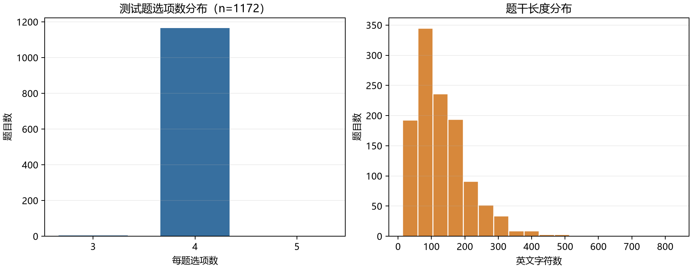

# E24：微调工具调用以后，科学题还答得好吗？

E24要回答的是：专门训练工具调用之后，模型做普通科学选择题的能力有没有变化？这一轮没有加载模型，也没有生成答案，所以现在还不能说变好或退步。先把数据、题目格式和评分分母固定下来，等 E09 训练队列释放显卡，再在同一条件下跑原模型和微调模型。

## 先弄清这次到底有多少题

本轮固定的是 ARC-Challenge 官方 test split。下载前先锁住数据仓库版本和文件哈希；文件落到本机后，又用 lm-evaluation-harness 自带的 ARC-Challenge task 重新读取，逐题核对 id、选项和目标答案索引。两边都是 1,172 题，题目 id 没有重复。

大多数题目有四个选项，但不是每道都刚好四个：1,165 题有四项，4 题有三项，还有 3 题有五项。按题目数算，完整评测会发出 4,687 条候选答案打分请求。题干长度从 13 到 831 个英文字符，中位数是 112；这些只是数据结构统计，没有查看或汇总 test 答案来挑模型。



## 零样本在这里具体指什么？

题目按 harness 的原始模板渲染：先给出科学问题，下一行是 Answer:，然后分别计算每个选项的条件对数似然。没有额外示例，也不套 Qwen 的聊天模板。这样比较的是同一种裸题格式下的基础知识回归，而不是提示词写法或工具调用格式。

```python
task.build_all_requests(
    limit=None,
    cache_requests=False,
    apply_chat_template=False,
)
```

这是本机实际运行的 harness 接口。limit=None 让它遍历完整 test split，apply_chat_template=False 则保持 ARC 原本的多项选择题格式。后续真正打分时还要确认逐题结果数与 1,172 一致，超时或解析问题不能从分母里拿掉。

官方 task 同时报告 acc 和 acc_norm。前者选总对数似然较高的答案；后者会按选项字符串长度归一化。这里的“长度”是字符串字符数，不是 tokenizer 的 token 数：

```python
completion_len = np.array([float(len(i)) for i in choices])
pred_norm = np.argmax(lls / completion_len)
```

因此两项指标可能不同，报告时应该并排保留，不能挑一个更好看的分数。

## 第一次下载为什么失败？不是数据地址错了

E24-R01 中，hf_hub_download 的文件预检收到了状态码 200，但响应没有 X-Repo-Commit。这个下载接口需要提交头来证明解析到的 revision，因而把请求当成不可复现资源拒绝了。检查项目里原有的公开资源下载流程后，我确认它遇到的是同一类 HEAD 元数据缺失：先通过固定版本 API 取得 LFS 哈希，再发 HTTPS GET，最后核对文件大小和 SHA-256。

我先单独试了整文件 GET。它实际收到 203,808 字节，SHA-256 与固定 revision 的官方 LFS 哈希完全相同。于是 E24-R02 改成按固定版本的元数据下载并验哈希，再把这份本地 Parquet 交给 harness 的官方任务配置。这样不靠服务器 HEAD 头来认版本，也不会悄悄换成数据集最新版本。R01 的错误和 R02 的修正各自保留，没有覆盖失败记录。

## 这一轮能下什么结论？

ARC 数据、task 模板和评分请求已经核对通过；本轮仍然没有模型推理结果。现在对“微调是否损伤普通科学问答”的结论是未测，不能写成“没有退步”。等模型进入评测后，原始 Qwen3-1.7B 与选定的 SFT、蒸馏模型会在同一个零样本设置下比较 acc、acc_norm，并检查逐题输出与分母。模型分数还没产生之前，不绘制成绩图，也不写提升幅度。

这一步的学习重点是把“准备好评测”与“已经测出结果”分开。接下来仍要留意：为什么 1,172 道题会变成 4,687 条评分请求？字符长度归一化可能怎样改变答案排序？这两个问题先留给后面的实际打分结果和复习，当前不代填掌握情况。
